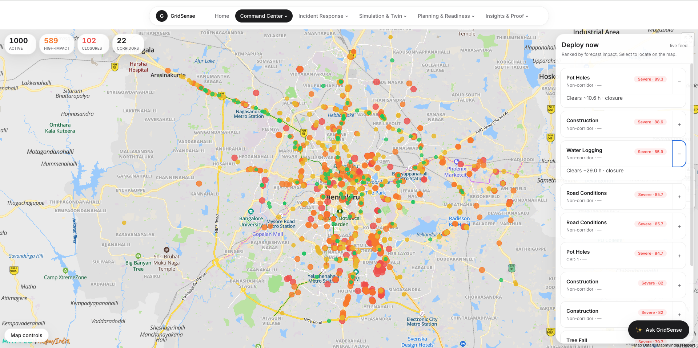
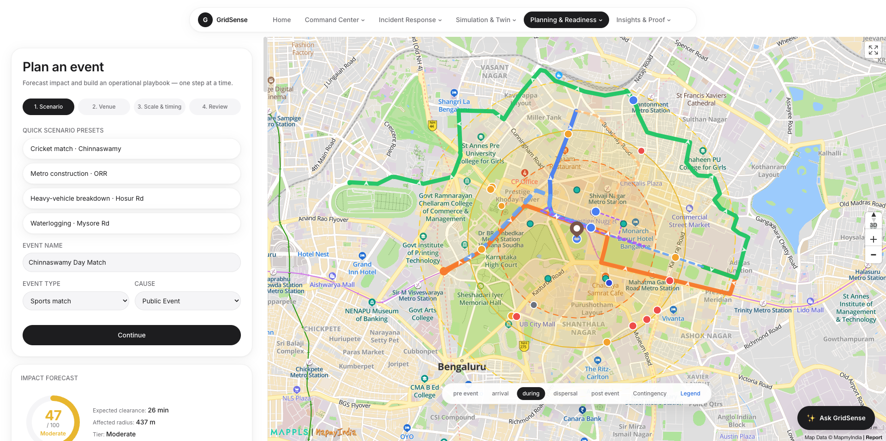
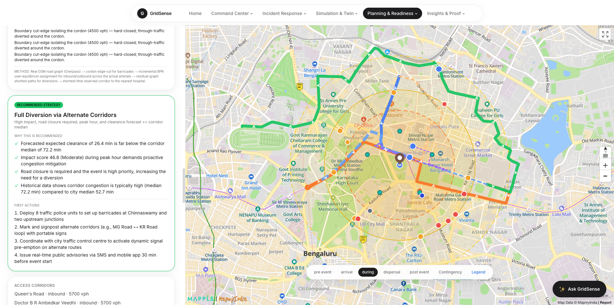
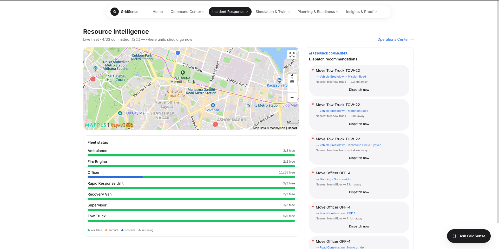

<div align="center">

<br/>

# GridSense

### AI Traffic Operations Platform

**Forecast the impact. Deploy with precision. Prove it in simulation. Learn from every outcome.**

<br/>

[](https://web-three-lovat-36.vercel.app/operations)
&nbsp;
[](https://web-three-lovat-36.vercel.app/operations)
&nbsp;
[](https://web-three-lovat-36.vercel.app/operations)

<br/>

> Built for **Flipkart Gridlock 2.0** · Problem: *Event-Driven Congestion (Planned & Unplanned)*
> Partners: **MapmyIndia / Mappls** · **Bengaluru Traffic Police (ASTraM)**

<br/>



*The Operations Center — live map of Bengaluru with every active incident, deployed unit, and city health score*

<br/>

</div>

---

## Try It Live — No Setup Needed

```
https://web-three-lovat-36.vercel.app/operations
```

```bash
# Or run locally:
cd web && npm install && npm run dev
# → http://localhost:3000/operations
```

No API keys. No database. No Python needed. Everything works out of the box.

---

## The Problem, In Plain English

Picture a Saturday evening. IPL match at Chinnaswamy. 40,000 people. Six corridors feeding into one stadium.

Today, here's what Bengaluru traffic police actually do:

- A senior officer remembers *"what we did last time"*
- Officers are dispatched based on gut feel
- Nobody knows in advance how bad the jam will be
- When the event is over, the notes go in a drawer — or nowhere at all

**The same mistakes repeat. Every. Single. Event.**

GridSense is built to fix exactly this. It answers the four questions the problem statement asks for:

| The Question | What GridSense Does |
|---|---|
| *How bad will it get?* | Forecasts impact **before** the event using 8,173 real ASTraM incidents |
| *Where do we deploy?* | Generates a complete manpower + barricade + diversion plan |
| *Will the plan actually work?* | Proves it by running a live traffic simulation — with vs. without the response |
| *How do we get better?* | Compares prediction to reality and corrects future forecasts |

---

## How It Works — The Full Journey

### Step 1 — The City Is Always Watching

Open GridSense and you land on the **Operations Center** — a live map of Bengaluru showing every active incident, every deployed unit, and the city's current health score.

<div align="center">


*1,000 active incidents across Bengaluru, ranked by severity. The ticker runs in real time — seeded from the real ASTraM corpus.*

</div>

The ticker runs in real time. Every few seconds, en-route units reach their incident, statuses flip, and a new incident injects into the feed — mimicking exactly how a real TMC operates through a shift.

```
Live incident feed (seeded from real ASTraM corpus)
  ├── INC-100  Vehicle Breakdown · Outer Ring Rd       [SEVERE]  → responding
  ├── INC-101  Water Logging · Mysore Rd               [HIGH]    → verified
  ├── INC-102  Road Construction · MG Road             [HIGH]    → detected
  └── INC-103  Traffic Accident · Hosur Rd             [MODERATE]→ clearing
```

---

### Step 2 — Something Happens. The AI Commander Kicks In.

Click any incident. The **AI Incident Commander** has already run its full assessment: risk level, historical precedents from 2,777 resolved events, recommended officer count, junction assignments, signal overrides, and diversion routes — before you click a single button.

The system finds the 15 most similar past incidents and tells you: *"The last 12 times a vehicle breakdown happened on this corridor at this time of day, the median clearance was 41 minutes. Your model estimate is within that band."* Or it flags a warning if the forecast looks off.

---

### Step 3 — Plan the Event Before It Starts

For planned events — cricket matches, processions, construction, VIP movements — GridSense lets you run a full impact analysis *before* anything happens.

<div align="center">



*Step 1: Pick a scenario preset — Cricket match at Chinnaswamy, Metro construction on ORR, waterlogging on Mysore Rd — and the map updates instantly.*

</div>

<br/>

<div align="center">


*Step 4: Full impact forecast (47/100 Moderate), recommended strategy, real diversion routes drawn on live MapmyIndia roads, and step-by-step first actions.*

</div>

Pick a scenario. The system instantly gives you:

**The impact forecast** — a 0–100 Impact Score with a full breakdown:

```
Impact Score: 78 / 100  →  SEVERE

  Duration factor    ████████████████░░  34%  (clearance ~90 min)
  Road closure       ████████████░░░░░░  22%  (full closure flagged)
  Cause severity     ████████░░░░░░░░░░  16%  (vehicle_breakdown)
  Corridor load      ████████░░░░░░░░░░  16%  (Outer Ring Rd, peak)
  Peak timing        ██████░░░░░░░░░░░░  12%  (Saturday 7pm)
```

**The field plan** — concrete resources, not vague suggestions:

```
Recommended strategy: Full Diversion + Signal Override

  Officers needed:     14  (6 at primary junction, 4 at diversion entry, 4 at exit)
  Barricade points:    3   (edge-cut at cordon boundary, classified by type)
  Signal overrides:    2 junctions
  Diversion route:     Queen's Rd → Cubbon Rd → Inner Ring Rd
  Traffic split:       50% / 33% / 17% across three approaches
  Emergency corridor:  Reserved — shortest path to St. John's Hospital
  Projected delay ↓:   ~41%
```

<div align="center">



*The full recommended playbook: why this strategy, historical justification, and concrete first actions — deploy 8 units, signpost corridors, activate dynamic signals, issue SMS advisories.*

</div>

---

### Step 4 — Prove the Plan Works (Strategy Wind Tunnel)

This is the single most powerful screen in GridSense.

The system runs four competing strategies through a live traffic simulation — same seed, same conditions, different interventions — and measures the actual outcome:

```
                    Vehicle-Hours  Max Queue  Clearance  Resource Cost
                    Lost           Length     Time
─────────────────────────────────────────────────────────────────────
Plan A  Recommended  ████░░░░░░     142 m      24 min     Medium      ← WINNER
Plan B  Diversion    █████░░░░░     198 m      31 min     Low
Plan C  Signals+Units████░░░░░░     175 m      28 min     High
Plan D  Do Nothing   ██████████     430 m      67 min     —
─────────────────────────────────────────────────────────────────────
Plan A saves 2.3 vehicle-hours vs. doing nothing.  41% delay reduction.
```

These numbers come from a **live traffic simulation** running in the browser — individual vehicles following the road network, queuing behind the incident, rerouting when diversions open. The "Do Nothing" baseline runs in parallel with the same seed, so the gap between the two lines is the *measured* impact of the police response.

Accept Plan A → diversions and field units deploy into the live ops store. The incident flips to `responding`. The metrics update. The plan appears on the map.

---

### Step 5 — Watch the Digital Twin

<div align="center">


*514 vehicles. 13 km/h mean speed. Real IDM physics. Click any road to inject an incident and watch the live line diverge from the baseline ghost — that gap is the delay your response prevented.*

</div>

The `/simulation` page is the engine room. A synthetic Bengaluru CBD — real road topology logic, real signal timing, real traffic physics — running live in your browser.

```
What you can do:
  → Click any road → inject an incident (25 types: breakdown, pothole,
    water_logging, accident, tree_fall, VIP movement, protest…)
  → Choose severity, affected lanes (Left / Right / Both)
  → Apply a response — diversion opens, signals override
  → Watch the Live line and the Baseline (ghost) line diverge on the chart
  → The gap between them = the delay your response prevented
```

> The simulation engine is cross-validated against SUMO (academic-standard microsimulator). **Delay matches to within ~3%.**

---

### Step 6 — Incident Management & Workflow Tracking

<div align="center">


*Every incident is a lifecycle object. The Kanban moves left to right: Detected → Verified → Responding → Managed → Clearing → Closed.*

</div>

<br/>

<div align="center">


*Every accepted plan generates tracked tasks with SLA timers. 7 breaches visible at a glance. Red = overdue.*

</div>

---

### Step 7 — Resource Intelligence

<div align="center">



*36-unit fleet on a live map. The AI Resource Commander recommends which unit to dispatch to which unresourced incident, with live ETA from MapmyIndia routing.*

</div>

---

### Step 8 — Operations Intelligence (Best-Known-Response Library)

<div align="center">


*Every accepted Wind Tunnel plan is stored here. Sports Event · CBD 2: 62% avg delay cut, 19 vehicle-hours saved. Over time this becomes an institutional memory that survives shift changes.*

</div>

---

### The Full Operations Loop

```
Observe            Detect           Assess            Simulate
/operations   →   /incidents   →   AI Commander   →  Wind Tunnel
    │                                                     │
    └── Monitor ←── Execute ←── Decide ←─────────────────┘
    /digital-twin   /workflows   Accept Plan
```

| Page | What it does |
|---|---|
| `/operations` | Live map command center. Every incident, unit, and deployment. AI ops brief refreshes every 30s. Copilot on the side. |
| `/incidents` | Kanban board — incidents move left to right through their full lifecycle. |
| `/incidents/[id]` | Full command screen for one incident. AI Commander + Wind Tunnel + dispatch controls + timeline. |
| `/workflows` | Every accepted plan generates tasks. Track them here with SLA timers. Red = overdue. |
| `/resources` | 36-unit fleet map. AI recommends which unit to dispatch to which unresourced incident, with live ETA. |
| `/events` | Planned event calendar. Forecast any event. Stage it as a live incident. Run Commander + Wind Tunnel on it. |
| `/digital-twin` | City health view — risk layers, emerging hotspot detection, live state trends. |
| `/intelligence` | Every accepted Wind Tunnel plan is stored here. Over time this becomes a Best-Known-Response library. |
| `/preparedness` | Night Watch — run "what could go wrong tonight" scenarios across all hotspots. Get a resilience grade and pre-positioning recommendations. |
| `/learning` | Predicted vs. actual. Calibration. Drift. Per-cause reliability. |
| `/proof` | Replay a historical day in the simulator. Backtest Plan A vs. Plan B. See vehicle-hours saved. |

---

## The Data Behind Everything

**Source:** ASTraM (Automated Signal Traffic Management) anonymized event log — Bengaluru Traffic Police.

```
8,173 incidents  ·  46 columns  ·  ~150 days  ·  Nov 2023 → Apr 2024
```

| Category | Count |
|---|---|
| Unplanned events (breakdowns, accidents, potholes, water_logging, tree_fall) | 7,706 |
| Planned events (construction, public events, processions, VIP movement, protests) | 467 |
| Events with measured clearance time (supervised training set) | 2,777 |
| Corridors | 22 |
| Zones | 10 |
| Police stations | 54 |
| Road closures | 676 |

The model is trained only on the resolved events. Nothing is made up.

---

## What's Real vs. What's Simulated

| Component | What it actually is |
|---|---|
| Impact forecast | Trained `HistGradientBoostingRegressor` on 8,173 real events. MedAE ~36 min. |
| Precedent engine | Weighted similarity over 2,777 real resolved incidents. Shows real P50/P90 actuals. |
| Routing | Live MapmyIndia OAuth2 → `route_adv/driving` — real Bengaluru roads, real routes. Falls back to OSM graph routing. |
| AI narration | Cerebras/Groq/Gemini LLM grounded strictly on computed metrics. Falls back to a deterministic rule engine if no key. |
| Live ops state | Seeded deterministically from the real ASTraM corpus. The ticker simulates shift progression. Not wired to a live feed — that boundary is clearly marked and swap-ready. |
| Traffic simulation | Real IDM physics engine. Synthetic road network (chosen for reliable topology — real OSM CBD grid caused signal deadlocks in testing). |
| SUMO validation | Cross-validated against SUMO (academic-standard microsimulator). **Delay matches to within ~3%.** |

---

## Architecture

```
┌─────────────────────────────────────────────────────────┐
│              Next.js 16 — deployed on Vercel            │
│   17 routes · all pre-computed · no Python at runtime   │
└──────────┬──────────────────────┬───────────────────────┘
           │                      │
    ┌──────▼──────┐       ┌───────▼───────┐
    │  Operations  │       │  Simulation    │
    │  (ops store  │       │  Engine        │
    │  + ticker    │       │  (IDM + signals│
    │  + AI brain) │       │  + incidents)  │
    └──────┬──────┘       └───────┬───────┘
           └──────────┬───────────┘
                      │
           ┌──────────▼──────────┐
           │  gridsense.ts        │
           │  forecast()          │
           │  recommend()         │
           │  correctionFor()     │
           │  + pre-computed JSON │
           └──────────┬──────────┘
                      │
           ┌──────────▼──────────┐
           │  External APIs       │
           │  Cerebras / Groq LLM │
           │  MapmyIndia routing  │
           └─────────────────────┘
```

**Why TypeScript AND Python?** The `ml/` folder is the research layer — it trains the model, computes priors, and builds road graphs. All output is committed as JSON. The Next.js app re-implements scoring in TypeScript, reads those JSON files at runtime, and runs entirely self-contained on Vercel. No Python. No cold starts. No database.

**State management:** The Operations Center uses a module singleton + React 19's `useSyncExternalStore`. Any module — API routes, the ticker, the simulation engine — can call `getOpsState()` and `emit()`. State persists to `localStorage` and re-seeds from the ASTraM corpus if >2h stale.

---

## Tech Stack

| Layer | What We Used |
|---|---|
| Web framework | Next.js 16 (App Router, Turbopack) · React 19 · TypeScript |
| Styling | Tailwind v4 · Framer Motion · Apple-inspired dark/light theme |
| Charts | Recharts |
| Maps | Mappls Web SDK v3 (WebGL) · Leaflet + CartoDB dark tiles · HTML Canvas (sim overlay) |
| ML | Python · scikit-learn `HistGradientBoostingRegressor` · pandas · numpy |
| AI | Gemini 2.0 / Cerebras gpt-oss-120b / Groq llama-3.3-70b — OpenAI-compatible, pluggable |
| Routing | MapmyIndia route_adv/driving · OSM Overpass + in-browser Dijkstra |
| Deploy | Vercel |

---

## 5-Minute Judge Walkthrough

1. **[`/operations`](https://web-three-lovat-36.vercel.app/operations)** — *"Here's the city right now. Active incidents ranked by severity, units deployed, AI ops brief."*

2. **[`/plan` → pick Cricket · Chinnaswamy](https://web-three-lovat-36.vercel.app/plan)** — *"Before the match: 78/100 impact, 14 officers, 3 barricade points, real diversion routes on the map. Not guesswork — computed from real ASTraM data."*

3. **`/incidents/[id]` → Run Wind Tunnel** — *"Plan A vs Do Nothing: 41% delay reduction, proven in simulation before a single officer is deployed."*

4. **[`/simulation`](https://web-three-lovat-36.vercel.app/simulation)** — *"Inject an incident, apply the response, watch the live and baseline lines diverge. That gap is the impact of police response — measured, not estimated."*

5. **[`/learning`](https://web-three-lovat-36.vercel.app/learning)** — *"After the shift: predicted vs. actual, per-cause reliability, calibration that improves every event."*

**The pitch:** Every other traffic dashboard shows you what's happening. GridSense tells you what's about to happen, tells you exactly what to do, proves the plan works before you act, and gets smarter after every event. That's the full loop the problem statement asked for.

---

## Running It

```bash
# Full demo — web app only (recommended)
cd web
npm install
npm run dev      # → http://localhost:3000/operations

# Regenerate ML artifacts (optional — already committed)
cd gridsense/ml
python prepare.py        # CSV → all JSON artifacts
python impact_model.py   # train + score
python learn.py          # calibration
cp artifacts/{learning,correction_factors,precedents}.json ../web/src/data/
```

### Optional: unlock live AI + live routing

Copy `web/.env.example` → `web/.env.local` and add any keys you have:

```bash
GEMINI_API_KEY=...           # AI playbook, ops briefs, Copilot
CEREBRAS_API_KEY=...         # Alternative (1M tokens/day free)
GROQ_API_KEY=...             # Alternative (100k tokens/day free)
MAPMYINDIA_CLIENT_ID=...     # Live Bengaluru routing + map tiles
MAPMYINDIA_CLIENT_SECRET=...
```

Without any keys, every page still works. The rule engine replaces the LLM. OSM graph replaces live routing. A badge in the UI always tells you which source produced the result.

---

<div align="center">

*GridSense — forecast the impact, deploy with precision, prove it in simulation, and learn from every outcome.*

</div>
