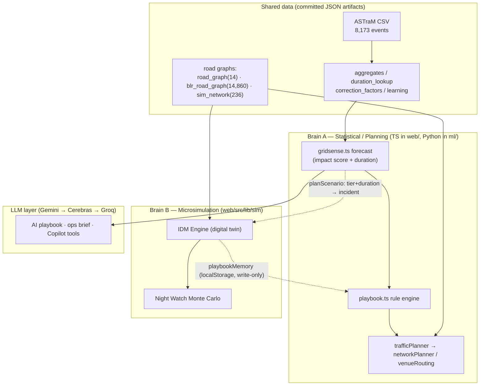
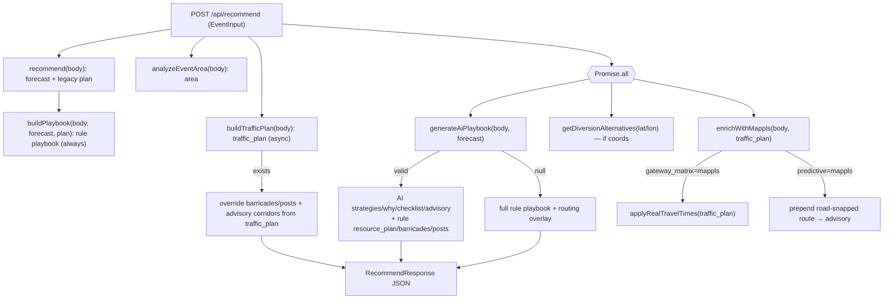
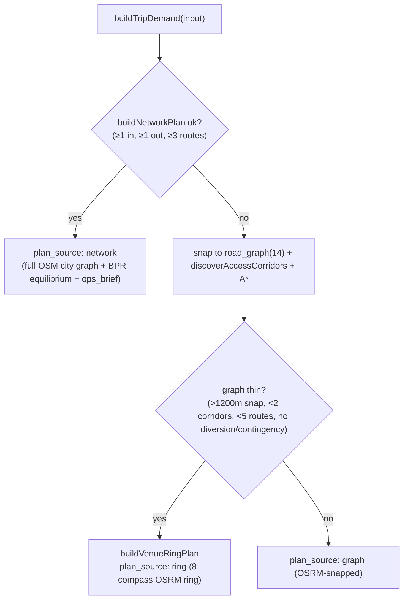
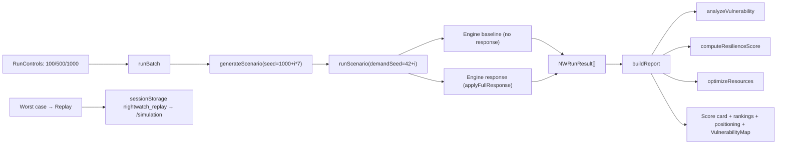

# GridSense — Complete Codebase Overview & Architecture Map

> **Purpose of this document.** A full, detailed discovery map of the GridSense codebase as it exists today: every module, what it does, how it interacts, its data/API flow, dependencies, assumptions, limitations, and observed gaps. This is **descriptive only** — it documents *what is there and how it works*. Redesign proposals, improvements, new features, and the formal "recommended future architecture" are intentionally **deferred** (per the discovery-mode brief) until the system model is signed off.
>
> Generated from a full read of the repository (web app, ML core, FastAPI service, data artifacts, configs, and docs). Section headings follow the requested framework.

---

## Table of contents

1. [System Overview](#1-system-overview)
2. [Frontend Architecture](#2-frontend-architecture)
3. [Backend Architecture](#3-backend-architecture)
4. [Simulation System](#4-simulation-system)
5. [Planning System](#5-planning-system)
6. [Night Watch](#6-night-watch)
7. [Learning System](#7-learning-system)
8. [Copilot System](#8-copilot-system)
9. [Data Sources](#9-data-sources)
10. [Resource Management](#10-resource-management)
11. [Event Management](#11-event-management)
12. [Command Center](#12-command-center)
13. [Maps](#13-maps)
14. [Current Strengths](#14-current-strengths)
15. [Current Weaknesses](#15-current-weaknesses)
16. [Technical Debt](#16-technical-debt)
17. [Integration Gaps](#17-integration-gaps)
18. [Open Questions](#18-open-questions)
19. [Appendix: file & constant reference](#19-appendix-file--constant-reference)

---

## 1. System Overview

**GridSense** is an *Event-Driven Congestion Intelligence* platform built for **Flipkart Gridlock 2.0** (problem: planned & unplanned event congestion), with partners **MapmyIndia/Mappls** and **Bengaluru Traffic Police (ASTraM)**. It turns a real, anonymized **ASTraM event log (8,173 events · 2023-11-09 → 2024-04-08, Bengaluru-wide)** into:

- a quantified **0–100 Impact Score** (auditable factor breakdown, backed by a learned clearance-duration model),
- an auto-generated **operational playbook** (strategies, manpower, barricades, diversions, checklists),
- a **traffic management plan** (ingress/egress routing, barricade & post placement on a map),
- a **microscopic traffic simulation** ("digital twin") that measures counterfactual delay reduction,
- a **Night Watch** Monte-Carlo preparedness/resilience analysis,
- a **post-event learning loop** (predicted-vs-actual calibration), and
- a tool-using **Copilot** chat assistant grounded on the same data.

### 1.1 The defining architectural fact: two parallel "brains" + a dual code path

GridSense is best understood as **two largely independent analytical engines** plus an LLM layer, sitting on top of shared historical data:

| Brain | What it is | Graph it runs on | Surfaces that use it |
|---|---|---|---|
| **A. Statistical / planning brain** | Learned duration lookup + weighted impact score + rule/AI playbook + graph traffic assignment (BPR) | `blr_road_graph.json` (14,860 nodes, full city) primary; `road_graph.json` (14 nodes, CBD) fallback | Plan an Event (`/plan`), Copilot, Command/Learning analytics |
| **B. Microsimulation brain** | Intelligent-Driver-Model (IDM) agent-based traffic twin | `sim_network.json` (236 nodes / 393 edges, CBD OSM extract) | Live Simulation (`/simulation`), Night Watch (`/nightwatch`), Plan proof card, Backtest (`/proof`) |

There is also a **dual code path** for Brain A: the **Python `ml/` core** is the research/credibility layer (trains the model, computes priors), and the deployed **Next.js `web/` app** re-implements the same scoring/recommend logic in TypeScript plus a model-derived lookup table, so it runs fully self-contained on Vercel (no Python at request time). A standalone **FastAPI service (`api/`)** mirrors the Python path for local demos but is *not* the deployed path.



### 1.2 Tech stack

| Layer | Technology |
|---|---|
| Web framework | **Next.js 16.2.9** (App Router, Turbopack) · **React 19.2.4** · TypeScript 5 |
| Styling | **Tailwind v4** (`@import "tailwindcss"` + `@theme`) + `:root` CSS variables; Apple-inspired light theme |
| Animation | **framer-motion 12** |
| Charts | **Recharts 3** |
| Maps | **Mappls Web SDK v3** (vector/WebGL) with **Leaflet 1.9 + react-leaflet 5** fallback; CARTO/OSM raster tiles |
| ML core | **Python** · pandas, numpy, **scikit-learn** (`HistGradientBoostingRegressor`), pyarrow, joblib |
| Standalone API | **FastAPI + uvicorn** (`api/`, local demo only) |
| External services | **Mappls** (OAuth2 token + Isochrone/Distance-Matrix/Predictive-route/POI), **OSRM** (public router for road snapping), **LLM** (Gemini/Cerebras/Groq, OpenAI-compatible) |
| Deploy | **Vercel** (`vercel.json` framework: nextjs) |

All external integrations **degrade gracefully**: no Mappls key → deterministic mock/synthetic routing; no OSRM → synthetic geometry; no LLM key → deterministic rule engine / template text.

### 1.3 The screens (routes)

| Route | Page | Role |
|---|---|---|
| `/` | Landing | Marketing overview, links to Command/Plan/Learning |
| `/command` | Command Center | Live map of events + hotspots, KPIs, historical day replay, validation tab |
| `/plan` | Plan an Event | Form → forecast + playbook + traffic plan + map overlays |
| `/plan/report` | Technical Plan Report | Printable/PDF report (from sessionStorage payload) |
| `/simulation` | Traffic Simulation | Live microscopic digital twin; inject incidents, apply interventions |
| `/nightwatch` | Night Watch | Monte-Carlo resilience/preparedness analysis |
| `/proof` | Replay & Prove | Backtest microsim A/B on historical CBD incidents |
| `/learning` | Post-Event Learning | Predicted-vs-actual calibration analytics |

Global chrome: a `FloatingNav` pill (hidden on `/plan/report`) and a global `CopilotDock` (hidden on `/plan/report`).

### 1.4 Repository layout

```
gridsense/
├── data/astram_events.csv          raw ASTraM log (8,173 rows)
├── ml/                             Python research core
│   ├── prepare.py                  CSV → cleaned features + aggregates/hotspots/precedents
│   ├── impact_model.py             train HistGBR duration model + score events
│   ├── scoring.py                  auditable 0–100 impact-score formula
│   ├── recommend.py                manpower/barricade/diversion rules
│   ├── learn.py                    predicted-vs-actual calibration + metrics
│   ├── playbook.py                 strategy catalog (Python mirror of TS)
│   ├── build_osm_graph.py          Overpass → blr_road_graph.json (14,860 nodes)
│   ├── build_road_graph.py         hand-typed road_graph.json (14 nodes, CBD)
│   ├── build_sim_network.py        CBD extract + topology repair → sim_network.json (236)
│   ├── build_synthetic_network.py  alternate 8×8 grid generator (same output path)
│   └── artifacts/                  committed model + JSON priors
├── api/                            FastAPI standalone (local demo, not deployed)
│   ├── main.py                     /forecast /recommend /events /hotspots /learning ...
│   └── service.py                  artifacts loader + MOCK MapmyIndia/feed clients
├── docs/PLAN_AN_EVENT.md           feature guide for /plan
└── web/                            Next.js 16 app (the deployed product)
    └── src/{app, components, lib, hooks, data}
```

> **Note on README drift.** The top-level `README.md` describes only *three* screens and a Groq-only AI layer. The codebase has since grown to **eight** routes, a microsimulation engine, Night Watch, a multi-provider LLM Copilot, and full-city OSM routing. Treat this document as the current-state source of truth.

---

## 2. Frontend Architecture

Next.js App Router under `web/src/app`, with components in `web/src/components`, business logic in `web/src/lib`, one hook in `web/src/hooks`, and bundled JSON in `web/src/data`.

### 2.1 Pages

| Page file | Route | Data it fetches | Key client state | Notable behavior |
|---|---|---|---|---|
| `app/layout.tsx` | (root) | — | — | Inter font, `FloatingNav`, `<main>` with `--nav-height` padding, global `CopilotDock` |
| `app/page.tsx` | `/` | — | — | Static marketing; **hardcoded stats** (+12%, 80%, 30%); CTAs to `/command`, `/plan`, `/learning` |
| `app/command/page.tsx` | `/command` | `GET /api/events?limit=2500`, `GET /api/hotspots?limit=350`, `GET /api/replay?date=` | events, hotspots, `showHeatmap`, `onlyActive`, replay state | **152 ASTraM dates hardcoded** (`DATASET_DATES`, `DATE_COUNTS`); local `KpiCompact`, `DriftChart` w/ hardcoded monthly accuracy; validation tab in replay |
| `app/plan/page.tsx` | `/plan` | `POST /api/recommend` | `input`, `result`, `selectedStrategy`, `selectedRouteId`, `activePhase`(="during"), `showContingency` | Reads `sessionStorage["gridsense_copilot_plan_input"]` (Copilot handoff); auto-runs on mount; "Generate Technical Plan" → `saveReportPayload` + opens `/plan/report` |
| `app/plan/report/page.tsx` + `layout.tsx` | `/plan/report` | — (reads sessionStorage) | `payload`, `error` | `TechnicalPlanReport` + print toolbar; nested layout cancels nav padding; `window.print()` |
| `app/simulation/page.tsx` | `/simulation` | — (client sim) | sim controls, incident injection, route test | Dynamic `SimMap` (SSR off); see [§4](#4-simulation-system) |
| `app/nightwatch/page.tsx` | `/nightwatch` | `GET /api/maptoken` (map only) | `simCount`(100/500/1000), `running`, `progress`, `report` | All Monte-Carlo compute client-side; see [§6](#6-night-watch) |
| `app/proof/page.tsx` | `/proof` | `GET /api/backtest` | `date`, `candidates`, `rows`, `totals`, `running` | Client-side `simulateAB`; logs to `playbookMemory`; accent `#0a84ff` (differs from global `#0071e3`) |
| `app/learning/page.tsx` | `/learning` | `GET /api/learning` | `d: Learning` | Recharts scatter (log domain `[5,100000]`), drift line, per-cause expandable cards |

### 2.2 Component library

- **`components/ui/`** — design primitives: `GlassPanel`, `Section`/`PageContainer`, `PillButton` (primary/secondary/ghost; uses raw `<a>` not Next `Link`), `KpiCard`, `ExpandableCard` (select + expand), `motion.tsx` (`FadeIn`, `ScrollReveal`, `StaggerChildren`, spring config).
- **`components/playbook/`** (15 files) — the Plan page result cards: `EventPlannerForm` (4-step wizard + `SAMPLE_SCENARIOS` + loads `/api/aggregates`), `ForecastSummaryCard`, `PlanSimulationCard`, `PrecedentCard`, `TrafficImpactCard`, `RoutingIntelligenceCard`, `RecommendedStrategyCard`, `OperationalPlaybook`/`StrategyCard`, `DiversionAdvisoryCard`, `ResourcePlanCard`, `FieldChecklist`, `Badges`, `TrafficMapLegend`, `VenuePickerMap`. (`TechnicalPlanReport` referenced by the report page is also part of this family.)
- **`components/sim/`** (9 files) — simulation UI: `SimMap`, `SimCanvasLayer`, `ControlBar`, `MetricsPanel`, `IncidentInjector`, `IncidentList`, `ResponsePanel`, `RouteTestPanel`, `Legend`.
- **`components/nightwatch/`** (9 files) — `RunControls`, `SimulationProgress`, `VulnerabilityMap`, `CorridorRankingsTable`, `JunctionRankingsTable`, `ResilienceScoreCard`, `WorstCaseScenariosCard`, `ResponseReadinessCard`, `ResourcePositioningCard`.
- **`components/copilot/CopilotDock.tsx`** — global chat dock (see [§8](#8-copilot-system)).
- **Top-level maps** — `MapView` (chooses Mappls vs Leaflet), `MapplsMap`, `BengaluruMap`, `ImpactGauge` (see [§13](#13-maps)).

### 2.3 Visualizations

- `ImpactGauge` (SVG arc, tier-colored) + `FactorBars` (impact contribution bars) on the forecast card.
- Recharts: learning calibration scatter & drift line (`/learning`), sim delay history (`MetricsPanel`), backtest bar charts (`/proof`, `PlanSimulationCard`).
- Map overlays (events, hotspots/heatmap, isochrones, routes, barricades, posts, facilities) — see [§13](#13-maps).
- Tier colors (`lib/ui.ts`): Severe `#ef4444`, High `#f97316`, Moderate `#eab308`, Low `#22c55e`.

### 2.4 Core user workflows

1. **Plan**: form (or Copilot handoff) → `POST /api/recommend` → forecast + strategies + traffic plan render in left panel, overlays on right map → optionally run the in-browser sim proof → generate printable report.
2. **Monitor**: Command Center live map → toggle heatmap/active → select events → enter replay mode to scrub 152 historical dates with learning context.
3. **Simulate**: digital twin → click to inject incident → review auto-generated `ResponsePlan` → apply intervention → watch live vs baseline metrics diverge.
4. **Prepare**: Night Watch → choose 100/500/1000 → run Monte Carlo → resilience score, vulnerable corridors/junctions, resource positioning → replay a worst case in the live sim.
5. **Prove**: `/proof` → pick a historical CBD day → backtest A/B microsim → vehicle-hours saved.
6. **Learn**: `/learning` → predicted-vs-actual calibration, drift, per-cause reliability.
7. **Ask**: Copilot dock (any page) → grounded Q&A and one-click "open full plan".

---

## 3. Backend Architecture

"Backend" is two things: (a) **Next.js API routes** (the deployed serverless backend) and (b) the **FastAPI service** (`api/`, local/standalone only). Most business logic lives in `web/src/lib` and runs inside the API routes (or client-side for the sim).

### 3.1 Next.js API routes (`web/src/app/api/*`)

No route sets `runtime`/`revalidate`/`dynamic`; default Node serverless. Only `recommend` and `copilot` set `maxDuration = 30`. **No auth or rate limiting** anywhere (demo).

| Endpoint | Method | Reads | Consumer | Notes |
|---|---|---|---|---|
| `/api/recommend` | POST | gridsense, playbook, ai, eventAnalysis, trafficPlanner, mapplsContext | `/plan` | Main orchestrator (below). **No try/catch** |
| `/api/forecast` | POST | gridsense | **none found** | Thin forecast-only wrapper; appears unused by UI |
| `/api/precedents` | POST | gridsense + precedent → `precedents.json` | `PrecedentCard` | k-NN historical analogs |
| `/api/events` | GET | `events_slim.json` | `/command` | Mock ASTraM feed; sort by impact, slice |
| `/api/hotspots` | GET | `hotspots.json` | `/command` | Grid heatmap cells |
| `/api/learning` | GET | `learning.json` | `/learning` | Full learning artifact |
| `/api/aggregates` | GET | `aggregates.json` + `model_meta.json` | `EventPlannerForm` | Dropdown options + model meta |
| `/api/maptoken` | GET | Mappls OAuth via gridsense | `MapView`, `VulnerabilityMap` | `{token|null}`, `Cache-Control: private, max-age=300` |
| `/api/backtest` | GET | `events_slim.json` + `sim_network.json` | `/proof` | CBD-twin-filtered candidates (≤1.8 km of center, 20–180 min) |
| `/api/replay` | GET | `events_slim.json` + `learning.json` | `/command` replay | Day bundle; `date` required (400 otherwise) |
| `/api/copilot` | POST | copilotTools + llm | `CopilotDock` | Tool-using LLM loop (below) |

#### `/api/recommend` orchestration (the spine of Plan an Event)



Key invariants (verified in `app/api/recommend/route.ts`):
- The **rule playbook is always computed** (deterministic fallback + the *only* source of reproducible `resource_plan` numbers).
- When AI succeeds, the response keeps **rule-engine resource numbers and traffic-plan geometry**, taking only strategy reasoning/advisory/checklist prose from the LLM.
- If a `traffic_plan` exists, its `barricade_points`/`deployment_posts` **overwrite** the playbook's synthetic ones, and advisory `impacted_corridor`/`candidate_alternates`/`control_points` are enriched from it.
- Response envelope: `{ forecast, mappls_context?, plan (legacy), playbook, area?, traffic_plan?|null, source:"ai"|"rules" }` (`lib/types.ts` → `RecommendResponse`).

### 3.2 FastAPI service (`api/`) — standalone / legacy

- `api/main.py`: `/health`, `/events`, `/hotspots`, `/active`, `/aggregates`, `POST /forecast`, `POST /recommend`, `/learning`. CORS `*`. `EventInput` defaults are Chinnaswamy-cricket-like (`priority="High"`, `is_planned=True`, `is_peak=True`, `hour=19`, `dow=5`).
- `api/service.py`: loads `ml/artifacts/`, runs the **live sklearn model** at request time (`duration_model.joblib`), `scoring.score_factors`, `recommend.recommend`, `playbook.build_playbook`; mock + live `MapMyIndiaClient` and a mock `LiveFeedClient`.
- **Divergence from web**: FastAPI uses the raw sklearn pipeline and does **not** apply `correction_factors.json` or the `duration_lookup.json` table; the web path uses the lookup table × correction factors. The docstring states the deployed app uses the Next.js routes; FastAPI is for local experimentation.

### 3.3 Business-logic libraries (`web/src/lib`) — map

| Domain | Files |
|---|---|
| Forecast & recommend | `gridsense.ts`, `types.ts` |
| Playbook | `playbook.ts`, `ai.ts`, `llm.ts`, `routingNarrative.ts` |
| Traffic planning | `trafficPlanner.ts`, `tripDemand.ts`, `dispersalSim.ts`, `trafficAssignment.ts`, `capacityModel.ts`, `networkPlanner.ts`, `venueRouting.ts`, `roadRouting.ts` |
| Graphs & pathfinding | `roadGraph.ts`, `cityGraph.ts`, `pathfinding.ts`, `graphSearch.ts` |
| Area & history | `eventAnalysis.ts`, `precedent.ts`, `playbookMemory.ts` |
| Maps | `trafficMapLayers.ts`, `mapplsContext.ts`, `mapplsServices.ts` |
| Copilot & misc | `copilotTools.ts`, `reportStore.ts`, `ui.ts` |
| Simulation | `lib/sim/*` (15 files) — see [§4](#4-simulation-system) |
| Night Watch | `lib/nightwatch/*` (7 files) — see [§6](#6-night-watch) |

---

## 4. Simulation System

A microscopic, agent-based **traffic digital twin** of the Bengaluru CBD, implemented entirely client-side in TypeScript under `web/src/lib/sim/` (15 files) with UI in `components/sim/` and the `useSimulation` hook.

### 4.1 Network

- **Graph:** `web/src/data/sim_network.json` — **236 nodes / 393 edges**, OSM CBD extract + topology repair (built by `ml/build_sim_network.py`). Meta: bbox 12.965–12.985 lat / 77.595–77.615 lon, **center `[12.975, 77.605]` = `CBD_CENTER`**, 73 signals, 20 boundary sources, 10 roundabouts, **100% strongly-connected, 100% routing success, 0 dead-ends**, 29 synthetic edges. A companion `sim_network_junctions.json` (235 nodes / 72 signals — slight count mismatch) is a precomputed junction audit.
- **`network.ts`** builds a runtime `SimNetwork` singleton: lane geometry (3.4 m lanes, 1.2 m centre gap, **left-hand traffic**), Bezier turn connectors, snap-to-edge, `nextEdges` with U-turn filtering.

### 4.2 Engine (`engine.ts`)

Fixed-timestep engine. **`step(dt)` order:** `spawnDemand → updateSignals → updateIncidents → moveVehicles → updateResources → processRerouteQueue → computeCongestion → metrics.accumulate`.

- **Car-following:** Intelligent Driver Model (`carFollowing.ts`, `DEFAULT_IDM`: aMax 1.6, b 2.2, T 1.3, s0 2.2, δ 4, decel clamp −8). Emergency/resource vehicles get `v0×1.3`, `T×0.5`, `s0=1.2`.
- **Routing:** Dijkstra for trips (no utilization), A* with utilization (α=0.9) for reroutes, Yen k-shortest for diversions, via `sim/routing.ts` → `lib/pathfinding.ts` + `lib/capacityModel.edgeCost`. Route cache (512 entries, 5 s TTL, invalidated on closure version bump).
- **Signals (`signals.ts`):** phases grouped by bearing (±40°), green `min(18, 9+lanes×2)` s, yellow 3 s, all-red 2 s, protected-left 8 s; adaptive mode extends/shortens on queue length; failed mode = all-red with straight creep; emergency preemption within 90 m.
- **Demand (`demand.ts`):** seeded `mulberry32` RNG; mix car 56% / auto 26% / bus 10% / truck 8%; trips between random boundary sources.

### 4.3 Incidents, Resources, Diversions

- **Incidents (`incidents.ts`):** `INCIDENT_CATALOG` of **25 types** with severity, lanes, duration ranges, and response templates. `SEVERITY_DURATION_MULT` low 0.7 / moderate 1.0 / high 1.4 / severe 1.9. Capacity loss is modeled as **blocked lane indices** (not fractional capacity); `closesRoad` → full blockage; `signalFailure` flag.
- **Resources (`resources.ts`):** `RESOURCE_META` (mobile flag, clearance boost, speed), `FLEET_CAPACITY` (e.g. officer 24, barricade 60, cones 120), `DEPOTS` + `depotFor()` (**unused** by the engine — it dispatches from rotating boundary sources via `pickDepot()`).
- **Diversions / interventions (gated by `applyInterventions`):** `applyDiversion(strategy, corridorEdges?)` (full/perimeter/corridor closure + local/split/oneway reroute share 40%/70%), `prioritizeCorridor()` (sets adaptive signals), `applySignalPlan()`.
- **DecisionEngine (`decisionEngine.ts`):** heuristic `buildResponsePlan(net, incident, congestion)` — up to 3 diversion corridors (Yen k=3, scored 0.7×util+0.3×length), traffic-split templates, projected delay reduction 8–70%, expected clearance from duration ÷ (1+clearance boosts). Used live in `ResponsePanel` and by headless sims.

### 4.4 Metrics (`metrics.ts`)

Incremental tracker: `totalDelayVehMin` / `vehicleHoursLost` (∫(v0−speed)/v0·dt), mean speed, mean travel time (arrivals), max queue, network utilization, throughput/min (rolling 60 s), congested-edge count (util>0.7), `gridlock` flag (active demand>30 AND mean speed<1.2 m/s). Canvas congestion colors at util 0.3/0.5/0.75/1.0 thresholds (+ `#7f1d1d` blocked).

### 4.5 How the UI drives it (`useSimulation.ts`)

- **`requestAnimationFrame`** loop (no setInterval, no Web Worker, main thread). Fixed **DT = 0.2 s**, **SEED = 1337**, speed multiplier 1/2/4/8× (≤240 substeps/frame), React snapshot every **200 ms**, initial **220-step warmup**.
- **Dual engines:** `liveRef` (`applyInterventions: true`, spawn 30/min) and `baseRef` ghost baseline (`applyInterventions: false`, same seed/incidents) for fair delay comparison.
- Map click → `snapToEdge` → inject incident on **both** engines + build response plan. Apply intervention → **live only** (diversion + signal plan + dispatch). Route-test panel injects 5 vehicles directly into `engine.vehicles`.
- Reads `sessionStorage["nightwatch_replay"]` to auto-inject a Night Watch worst-case on load.

### 4.6 Three distinct simulation profiles (important)

The same `Engine` is run with **three different parameter sets** depending on caller:

| Profile | Caller | DT | Spawn/min | Max veh | Warmup |
|---|---|---|---|---|---|
| **Live** | `useSimulation` (`/simulation`) | 0.2 s | 30 | 550 | 220 steps |
| **Wind tunnel** | `strategySimulator.ts` (Plan proof, `/proof`) | 1.0 s | 110 | 300 | 90 steps |
| **Night Watch** | `monteCarloRunner.ts` | 1.0 s | 75 | 200 | 60 steps |

`strategySimulator.ts` runs paired-seed counterfactuals across 4 strategies (`do_nothing`, `recommended`, `diversion_only`, `signals_resources`); `simulateAB` is the lighter baseline-vs-recommended version used by `/proof`. `planScenario.ts` bridges a Plan `EventInput`+forecast → a sim scenario, gated by a **750 m service radius** (`SERVICE_SNAP_M`) around the CBD twin.

---

## 5. Planning System

The "Plan an Event" brain (Brain A). Converts an `EventPlannerInput` into a forecast, a playbook, and a traffic plan. Documented in detail in `docs/PLAN_AN_EVENT.md`; the engine internals are below.

### 5.1 Impact Forecasting (`lib/gridsense.ts` ≈ `ml/scoring.py`)

**Impact Score = round(100 × clamp(Σ wᵢ·factorᵢ), 1)**, weights summing to 1.0:

| Factor | Weight | Computation (clamped 0..1) |
|---|---|---|
| `duration` | **0.34** | `expected_duration_min / 720` (`DURATION_SATURATION_MIN`) |
| `closure` | **0.22** | 1 if `requires_road_closure` else 0 |
| `cause` | **0.16** | `aggregates.cause_severity[cause]` → else median-duration ratio → else 0.4 |
| `location` | **0.16** | `aggregates.corridor_sensitivity[corridor]` → else 0.4 |
| `timing` | **0.12** | peak 1.0 / off-peak 0.45; +0.2 if `priority="High"` |

- **Tiers:** ≥70 Severe, ≥50 High, ≥30 Moderate, else Low. **Affected radius (m) = round(250 + 4·score)**.
- **Expected duration:** lookup `duration_lookup.json` keyed `table[cause][corridor]["{closure}{peak}"]` (binary encoding `00/01/10/11`), default 60 min, then × `correctionFor(cause,corridor)` (post-event calibration, clipped 0.5–2.0).
- The web path is a faithful TS port of the Python model via the committed lookup table; `event_type`, attendance, gates, parking are **not** consumed by the forecast (they feed the traffic/playbook layers only).

### 5.2 Recommendations / resource formulas (`gridsense.ts` ≈ `ml/recommend.py`)

- **Manpower:** base by tier (Severe 12 / High 7 / Moderate 4 / Low 2) `+ max(0, junctions−1)×2` `+4` if closure `×1.3` (ceil) if peak `+2` if real corridor. Shifts 2 if duration>240 else 1. Head constables `max(1, ⌊mp/4⌋)`, wardens 2 if closure else 1.
- **Barricades:** closure `4 + junctions×2`; else Severe/High `2 + junctions`; else Moderate `junctions`; else 0.
- **Diversion needed:** `closure OR tier=Severe`; advisory lead-time 60 min if planned.
- **Equipment:** `CAUSE_EQUIPMENT` map (10 cause keys) + default cones/caution-boards.

### 5.3 Playbooks (`lib/playbook.ts` ≈ `ml/playbook.py` + optional `lib/ai.ts`)

- **Catalog of 7 strategies:** `full_diversion`, `partial_flow`, `peak_hour_restriction`, `rapid_clearance`, `heavy_vehicle_diversion`, `public_advisory_first`, `junction_protection`. Each carries fixed `reduction/resource/barricade/comms/complexity` ratings + base reasoning/actions.
- **Rule decision tree (`selectStrategies`):** closure → full_diversion (+junction_protection, +public_advisory_first, +peak_hour_restriction if planned); breakdown/accident → rapid_clearance (+partial_flow, +junction_protection, +heavy_vehicle_diversion if heavy); planned long public/construction → peak_hour_restriction/public_advisory_first; water/tree/pothole → rapid_clearance; else junction_protection (sensitive corridor) or partial_flow. Dedupe → fill to ≥3 → cap 5.
- **Resource plan ranges**: officers `${total−2}-${total+4}`, barricades `${bars−1}-${bars+2}`. Synthetic barricade points on a 240 m ring (overwritten by the traffic plan when present).
- **AI playbook (`ai.ts`)**: builds grounding JSON (aggregates + forecast + event), calls `getLlm()` (temp 0.4, JSON mode, 20 s timeout), validates 3–5 strategies w/ exactly one recommended; returns `null` (→ rules) on any failure. Provides strategies/why/advisory/checklist only — never resource numbers.

### 5.4 Traffic Planning (`lib/trafficPlanner.ts` + dependencies)

`buildTrafficPlan(input)` (null if no lat/lon) runs an engine **cascade**:



- **Trip demand (`tripDemand.ts`):** occupancy & walk-share tables per `event_type`; `total_vehicle_trips = round(attendance·(1−walk)/occupancy)`; Gaussian arrival (8 buckets) / departure (6 buckets) curves; peak VPH = max bucket share × trips × 4; mode split (private_car fixed 0.55).
- **Network planner (`networkPlanner.ts`, primary):** `cityGraph.extractSubgraph` from `blr_road_graph.json` (14,860 nodes), cordon edge-cut gateway discovery, **BPR user-equilibrium assignment** (`trafficAssignment.ts`, 12 increments, α=0.9, β=4, virtual super-source/sink), emergency corridor to nearest hospital, k-shortest contingency, bottleneck detection (util≥0.6), `narrative_grounding` → `generateOpsBrief` LLM (temp 0.3, template fallback).
- **Capacity model (`capacityModel.ts`):** free-flow speeds by road class, `bprCost` (α 0.15/β 4 display, α 0.9 assignment), `edgeCost`, `assignFlowToEdges`, `criticalEdges` (threshold 0.85).
- **Dispersal (`dispersalSim.ts`):** analytical (not microsim) p50/p90 across scenarios (`nominal`, `one_primary_closed`, `rain_slowdown_20pct`).
- **Road snapping (`roadRouting.ts`):** OSRM `route/v1/driving` (8 s timeout) for real geometry; null → synthetic.

### 5.5 What's learned vs rule-based vs AI vs deterministic

| Component | Nature |
|---|---|
| Duration lookup | **Learned** (HistGBR → `duration_lookup.json`) |
| Correction factor | **Learned** post-event (`correction_factors.json`) |
| Impact score, tier, radius | **Deterministic** formula over learned duration + priors |
| Manpower / barricades | **Rule-based** (always reproducible) |
| Strategies / why / checklist | **AI** (LLM) if key present, else **rule engine** |
| Traffic routes / assignment | **Deterministic** graph + BPR; **OSRM/Mappls** geometry/ETA when available |
| Precedent band | **Retrieval** over historical corpus |

---

## 6. Night Watch

A **Monte-Carlo preparedness & resilience** subsystem (`web/src/lib/nightwatch/`, 7 files + 9 UI components + `/nightwatch`). Reuses Brain B's `Engine` directly. **All computation is client-side, main thread; no API route, no worker, no persistence.**

### 6.1 Flow



### 6.2 Scenario generation (`scenarioGenerator.ts`)

Per scenario (seeded `mulberry32`): incident type from `TYPE_WEIGHTS` (**only 10 of 25** catalog types appear), severity by category, **location weighted by road class + hotspot proximity** (within ~1 km of a `hotspots.json` cell), start time across 24 hourly buckets with peak multipliers, duration from catalog × severity × correction factor. `startTimeSec` is generated but **never applied** in the sim.

### 6.3 Monte Carlo (`monteCarloRunner.ts`)

100/500/1000 iterations; each = one scenario + paired baseline/response engines (DT 1.0, spawn 75, max 200, 60-step warmup). Response runs `applyFullResponse` (diversion w/ corridor from `buildResponsePlan`, signal plan, all catalog resources). Yields to the event loop every 10 iterations. Per-run derived metrics: `improvementPct`, `queueGrowthM`, `spilloverEdgeCount` (BFS ≤3 hops on baseline congestion), `clearanceTimeSec`, `resourcesSatisfied` (measured at dispatch instant).

### 6.4 Analysis

- **Vulnerability (`vulnerabilityAnalyzer.ts`):** per-corridor `riskScore = avgDelay·1.5 + worstDelay·0.5 + avgSpillover·5 + runs·2` (top 20); per-junction `riskScore = count·3 + avgQueueImpact` (top 10).
- **Resilience (`resilienceScore.ts`):** 0–100 composite from 5 weighted sub-scores (intervention effectiveness 30%, worst-case 25%, containment 20%, resource sufficiency 15%, recovery 10%); grades A≥90/B≥80/C≥65/D≥50/F. The factor `breakdown` is computed but **not surfaced** in the report.
- **Resource positioning (`resourceOptimizer.ts`):** sums catalog resource demand per (type, edge); recommends moving 5 mobile types to highest-demand corridors; `expectedImprovementPct = corridorAvgImprovement·0.4`; static `DEPOT_NAMES`. Not validated by re-running the sim.
- **Report (`buildReport.ts`):** resilience score/grade, top 10 corridors, top 5 junctions, 5 worst scenarios, resource positioning, `avgImprovementPct`, gridlock count (baseline), resource sufficiency % (80% threshold).

### 6.5 Integration

Only outbound link is the **Replay → `/simulation`** handoff via `sessionStorage`. Night Watch shares the map components and `/api/maptoken` but has **no shared state with Plan/Command/Copilot**, and the "Night Watch / overnight" branding is aspirational — runs are manual button clicks.

---

## 7. Learning System

The post-event learning loop is **offline batch** (Python) plus several runtime-read artifacts and two history mechanisms.

### 7.1 Calibration (`ml/learn.py` → `correction_factors.json`, `learning.json`)

- Loads the trained model + `features.parquet`, sorts by time, **temporal split: first 70% train (n=1943) / last 30% holdout (n=834 from 2024-03-05)**.
- Correction factor per segment: `raw = median(actual / pred_base)`, then `factor = clip(1 + SHRINK·(raw−1), 0.5, 2.0)` with SHRINK 0.8; `by_cause` (min 30 events), `by_cause_corridor` (min 25). Example: water_logging clipped to max **2.0**, construction 0.906.
- Holdout metrics (committed): tier accuracy 76.1% → **77.9%**, bucket 49.0% → 51.0%, within ±50% 33.1% → 33.8%, MAE 626.4 → 619.1 min. Median AE ~36 min is the headline operationally-relevant figure.
- **Honesty note in code:** this calibrates the *forecast* only — it does **not** measure intervention effectiveness.

### 7.2 Where calibration is applied

- **Web forecast** applies `correctionFor()` (`gridsense.ts`). **FastAPI does not** (uses raw sklearn output) — a divergence between the two backends.

### 7.3 Historical analysis surfaces

- **`/learning` page** (`learning.json`): before/after deltas, calibration scatter (~400 pts), monthly drift, per-cause reliability, error band (p10/p50/p90), 12 worst-miss samples.
- **Precedent retrieval (`lib/precedent.ts`)**: k-NN over `precedents.json` (**2,777** resolved events) with weighted similarity (cause 0.45, corridor 0.20, geo 0.15 w/ 12 km falloff, closure 0.12, peak 0.08) → P50/P90 clearance band, closure rate, tier mix, `forecast_within_band`. Served at `/api/precedents` and surfaced in `PrecedentCard` and the Copilot.

### 7.4 Feedback loops (current state)

| Loop | Mechanism | Closed at runtime? |
|---|---|---|
| Forecast calibration | `learn.py` → `correction_factors.json` → web forecast | **No** (offline; manual regen + copy) |
| Counterfactual "memory" | `playbookMemory.ts` (browser `localStorage`, key `gridsense_playbook_memory_v1`, cap 300) written by Plan proof card + `/proof` backtest | **No** — written and displayed, but **never read back** into `recommend()`/`buildPlaybook()` |
| Intervention effectiveness | Measured only inside sims (delay reduction) | **No** — never persisted to ML or recommendations |

---

## 8. Copilot System

A tool-using LLM chat assistant grounded on the same data/engines.

### 8.1 Models (`lib/llm.ts`)

Single provider selector, OpenAI-compatible chat completions. **First key wins, in order:**
1. **Gemini** (`GEMINI_API_KEY`) — `gemini-2.0-flash`
2. **Cerebras** (`CEREBRAS_API_KEY`) — `gpt-oss-120b` (`reasoning_effort: low`)
3. **Groq** (`GROQ_API_KEY`) — `llama-3.3-70b-versatile`

Three LLM call sites use this: `ai.ts` (playbook, temp 0.4, JSON, 20 s), `routingNarrative.ts` (ops brief, temp 0.3, 12 s, template fallback), and `/api/copilot` (temp 0.3, tools, 15 s/call).

### 8.2 Reasoning loop (`app/api/copilot/route.ts`)

`POST {message, history}` → system prompt injects live `CAUSES`/`CORRIDORS` → LLM with `TOOLS` and `tool_choice: "auto"` → **up to 3 tool rounds** (`executeTool` → tool messages → repeat) → final answer; if rounds exhausted, one final call without tools. Returns `{reply, cards, source:"ai"|"unavailable"|"error"}`. No key → graceful "unavailable" message.

### 8.3 Tools & grounding (`lib/copilotTools.ts`)

| Tool | Grounds on | Returns |
|---|---|---|
| `query_stats` | `aggregates.json` | dataset window, medians, severity/sensitivity, top causes/corridors |
| `find_events` | `events_slim.json` | filtered count, avg impact, closure rate, examples |
| `find_similar_events` | `forecast()` + `precedent.findSimilarEvents` (`precedents.json`) | median/P90 clearance, tier mix, `forecast_within_historical_band` |
| `plan_event` | `recommend()` + `buildPlaybook()` (rules) + precedent | a `type:"plan"` card (forecast, strategy, resource_plan, precedent) |

Venue grounding: a **12-entry hardcoded `VENUES` gazetteer** (Chinnaswamy, Freedom Park, Majestic, KSR, Palace Grounds, Vidhana Soudha, MG Road, Silk Board, Electronic City, Hebbal, Whitefield, Town Hall). Unknown causes default to `public_event`/`others`; unknown corridors → `Non-corridor`.

### 8.4 UI handoff (`components/copilot/CopilotDock.tsx`)

Global dock (hidden on `/plan/report`). Renders plan cards; **"Open full plan →"** writes the resolved `EventInput` to `sessionStorage["gridsense_copilot_plan_input"]` and navigates to `/plan`, which auto-runs the *full* `/api/recommend` pipeline (AI + Mappls + traffic plan). **Note:** the Copilot's `plan_event` tool uses the **rule engine only** (no AI playbook / Mappls / traffic planner) — so the dock card and the full Plan page can differ.

---

## 9. Data Sources

### 9.1 Historical data

- **`data/astram_events.csv`** — raw anonymized ASTraM log, **8,173 events** (2023-11-09 → 2024-04-08), **2,777 resolvable** (have clearance duration). Columns: id, event_type (planned flag), event_cause, lat/lon (+ unused end coords), address, corridor, zone, junction, police_station, veh_type, description, status, priority, requires_road_closure, start/closed/resolved/end datetimes. PII pre-redacted. No congestion-severity label (impact built from proxies).

### 9.2 ML artifacts (`ml/artifacts/`, produced by Python)

| Artifact | Produced by | Shape / key facts |
|---|---|---|
| `features.parquet` | prepare.py | 2,777-row modeling table (ML only) |
| `duration_model.joblib` | impact_model.py | HistGBR pipeline (FastAPI runtime only) |
| `model_meta.json` | impact_model.py | MAE 488.7, MedAE 35.9, R²(log) 0.314, n_train 2777, baseline median 52.7 |
| `aggregates.json` | prepare.py | medians, cause_severity, corridor_sensitivity, counts, dimension lists; n_events 8173, n_resolvable 2777 |
| `hotspots.json` | prepare.py | ~500 m grid cells `{lat,lon,count,closure_rate,high_priority_rate}` |
| `precedents.json` | prepare.py | 2,777 resolved events w/ actual duration, tier, impact_score |
| `events.json` / `scored_events.json` | prepare/impact_model | full + scored records (ML/FastAPI only) |
| `correction_factors.json` | learn.py | by_cause / by_cause_corridor (clip 0.5–2.0, shrink 0.8, train_until 2024-03-05) |
| `learning.json` | learn.py | before/after metrics, drift, scatter, samples, methodology |

### 9.3 Web data (`web/src/data/`, consumed by Next.js)

- **Copies** (content matches ML): `aggregates`, `model_meta`, `duration_lookup`, `correction_factors`, `learning`, `hotspots`, `precedents`.
- **Web-only**: `events_slim.json` (slim scored subset for routes), `road_graph.json`, `blr_road_graph.json`, `sim_network.json`, `sim_network_junctions.json`.
- **No generator in repo** for `duration_lookup.json` or `events_slim.json` (and no automated `ml/artifacts → web/src/data` sync script) — these are produced manually/out-of-band → **drift risk**.

### 9.4 Road graphs (three, for different subsystems)

| Graph | File | Nodes/edges | Built by | Used by |
|---|---|---|---|---|
| Full city OSM | `blr_road_graph.json` | 14,860 / 26,932 (+1,088 hospitals) | `build_osm_graph.py` (Overpass) | `cityGraph.ts` → `networkPlanner` (primary plan) |
| Synthetic CBD | `road_graph.json` | 14 / 27 | `build_road_graph.py` (hand-typed) | `roadGraph.ts` (fallback plan, map `getEdge`) |
| Sim CBD extract | `sim_network.json` | 236 / 393 | `build_sim_network.py` (CBD extract + repair) | `sim/network.ts` (digital twin, Night Watch, backtest) |

(`build_synthetic_network.py` is an alternate 8×8-grid generator writing the **same** `sim_network.json` path — not used in the committed state, which is OSM-derived.)

### 9.5 Learning artifacts in the loop

`correction_factors.json` (runtime forecast calibration), `learning.json` (analytics/replay), `precedents.json` (retrieval), `playbookMemory` (localStorage counterfactuals — runtime-written, not persisted server-side).

---

## 10. Resource Management

Resources appear in **three disconnected representations**:

### 10.1 Planning resources (recommend / playbook)

- Output types (`lib/types.ts`): `ResourcePlan` (officers/barricades ranges, shifts, head_constables, constables, wardens, special_units, narrative), `BarricadePoint` (hard/soft/coning; purpose vehicle/crowd; officers_required; phase_active), `DeploymentPost` (roles: traffic_point, crowd_control, diversion_guide, vip_escort, quick_response; shift; phase_active), `ControlPoint`.
- Formulas in [§5.2](#52-recommendations--resource-formulas-gridsensets--mlrecommendpy). Equipment by cause (cones, pumps, recovery crane, etc.) via `CAUSE_EQUIPMENT`.
- Barricade/post **placement**: synthetic ring (`playbook.ts`) → overwritten by graph/network placement (`networkPlanner`/`venueRouting`) when a traffic plan exists (cordon edge-cut, `OFFICERS_BY_CLASS` arterial 4 → local 1).

### 10.2 Simulation resources (digital twin)

- `RESOURCE_META` + `FLEET_CAPACITY` (officer 24, barricade 60, cones 120, …). Mobile resources are spawned as vehicles from the nearest boundary source; on-scene resources boost incident clearance (tow_truck 0.5, rapid_response 0.25, officer 0.15, …). Catalog response templates per incident type specify which resources to dispatch.

### 10.3 Night Watch resource positioning

- `resourceOptimizer` recommends pre-positioning **5 mobile types** (tow_truck, officer, ambulance, fire_engine, recovery_van) to highest-demand corridors using a static `DEPOT_NAMES` map and a 40%-of-full-benefit heuristic.

**Resource taxonomy is not unified:** the named role set (head constables/constables/wardens) in planning, the `ResourceType` set (tow_truck/officer/ambulance/fire_engine/recovery_van/barricade/cones/maintenance_crew) in the sim, and the depot strings in Night Watch are separate vocabularies. Specific asset classes requested by the framework map as follows: **Tow trucks** → sim `tow_truck` + optimizer; **Police** → planning constables/head_constables/wardens + sim `officer`; **Barricades** → `BarricadePoint` + sim `barricade`/`cones` capacity; **Emergency vehicles** → sim `ambulance`/`fire_engine` + emergency-access route + nearest-hospital corridor; **Recovery teams** → `recovery_van`/`maintenance_crew` + `CAUSE_EQUIPMENT` (recovery crane).

---

## 11. Event Management

There is **no calendar/scheduling subsystem**. "Event management" is realized as a forecast → plan → (simulate) → execute-checklist flow, all initiated manually:

| Framework concept | What actually exists |
|---|---|
| **Calendar** | None. Events are entered ad-hoc via the Plan form or chosen from `SAMPLE_SCENARIOS` (Cricket·Chinnaswamy, Metro construction·ORR, Heavy-vehicle breakdown·Hosur Rd, Waterlogging·Mysore Rd) / Copilot venue gazetteer. Command Center replay scrubs **152 hardcoded historical dates**. |
| **Simulation** | `PlanSimulationCard` (Plan) + `/proof` backtest run the digital twin as a *proof/counterfactual* for a single event, gated by the 750 m CBD service radius. |
| **Planning** | `/plan` → `/api/recommend` produces forecast + playbook + traffic plan. |
| **Execution** | `FieldChecklist` (before/during/after, local check-off, not persisted) + `TechnicalPlanReport` (printable PDF). No live execution tracking, assignment, or status feedback. |

Event identity/scale/timing inputs are captured in `EventPlannerInput` (`event_type`, `attendance_band`, gates, hours, etc.), but several (event_type, attendance, gates, parking, start/end hour) influence only the **traffic/playbook** layers — not the impact forecast.

---

## 12. Command Center

`/command` (`app/command/page.tsx`) — the live monitoring dashboard.

- **Monitoring:** full-viewport `MapView` with impact-colored event pins (`GET /api/events?limit=2500`) and a toggleable risk heatmap from hotspots (`GET /api/hotspots?limit=350`). `onlyActive` filter.
- **Operations:** ranked "deploy resources now" panel (top 12 events by impact_score) via `ExpandableCard`.
- **Dashboards / KPIs:** compact KPI strip (local `KpiCompact`, not the shared `KpiCard`); a `DriftChart` with **hardcoded** monthly accuracy (Nov 62.7% … Apr 49.1%).
- **Historical replay & validation:** replay mode scrubs **152 hardcoded `DATASET_DATES`**; `GET /api/replay?date=` returns that day's events + learning samples + monthly drift + by-cause rows; a validation tab shows accuracy cells.
- **Alerts:** **none** — there is no real-time alerting, thresholds, or notification mechanism. The "live" feed is static `events_slim.json` (a mock ASTraM stream, swap-ready per comments).

---

## 13. Maps

### 13.1 Map components & selection

- **`MapView`** calls `GET /api/maptoken`; if a Mappls token + WebGL are available (and Mappls hasn't errored) → **`MapplsMap`** (Mappls Web SDK v3, vector/WebGL); otherwise → **`BengaluruMap`** (Leaflet + CARTO light raster). Both share the `MapProps` contract.
- **`VenuePickerMap`** — independent Leaflet+OSM click-to-pick used inside the Plan form (visually distinct from the result map).
- **`SimMap`/`SimCanvasLayer`** — Leaflet dark basemap + a `requestAnimationFrame` canvas overlay drawing roads/congestion/vehicles/signals/incidents for the digital twin.
- **`VulnerabilityMap`** (Night Watch) — same Mappls/Leaflet selection, renders corridor risk as a heatmap.

### 13.2 Layers & overlays

Drawn by both `MapplsMap` and `BengaluruMap` (color-matched): events (tier-colored), hotspots/heatmap (`#ef4444`), isochrones (drive-time polygons), focus circle (impact radius), diversion routes (primary green / secondary amber / heavy red), traffic routes (per `trafficMapLayers.ts`), traffic arrows, barricades (soft `#f59e0b` / hard `#ef4444` / crowd teal), deployment posts (`#3b82f6`), facilities (hospital/police/fuel/parking POIs).

`trafficMapLayers.flattenTrafficRoutes` maps the `TrafficRouteBundle` to polylines with phase filtering and volume-based widths: primary_inbound `#3b82f6`, secondary_inbound `#60a5fa` dashed, primary_outbound `#f97316`, secondary_outbound `#fdba74` dashed, through_diversion `#22c55e`, emergency `#a855f7` dashed, contingency `#9ca3af`, bottleneck `#ef4444`. **Note:** the Plan page passes `showAllPhases=true`, so the phase pills don't actually filter routes (only contingency toggles).

### 13.3 Routing & enrichment (`mapplsServices.ts`, `mapplsContext.ts`)

Server-side Mappls REST helpers (auth via `MAPPLS_REST_KEY` or OAuth token; 6 s timeout), each with a synthetic fallback:

| Service | Mappls endpoint | Use |
|---|---|---|
| Isochrone | `routev2/optimization/isopolygon` | 10/20-min drive-time rings on map |
| Distance matrix | `route/dm/distance_matrix_traffic/driving` | gateway ETAs → `applyRealTravelTimes` |
| Predictive route | `routev2/direction/route` | road-snapped primary diversion (prepended to advisory) |
| POI along route | `search/places/along-route` | hospital/police/fuel/parking facilities |

`enrichWithMappls` runs these in parallel and returns a `MapplsContext` (with `*_source: mappls|osrm|synthetic` badges shown in the legend). **OSRM** (`roadRouting.ts`) is used separately for general road-snapping of route geometry.

---

## 14. Current Strengths

*(Observational — strengths evident in the code as written.)*

1. **Auditable, data-grounded forecasting.** The impact score is a transparent weighted formula over a *learned* duration model, with per-factor contributions surfaced in the UI; tiers/radius/manpower are reproducible.
2. **Genuine post-event calibration with honest evaluation.** `learn.py` uses a **temporal holdout** (not random) and reports before/after metrics including where it *doesn't* help — and the code explicitly disclaims measuring intervention effectiveness.
3. **A real microscopic simulation.** IDM car-following, signalized + unsignalized junctions, incident lane-blocking, emergency preemption, adaptive signals, paired baseline/response engines for fair counterfactuals — on a topology-repaired 100%-SCC OSM CBD network.
4. **Layered graceful degradation.** Every external dependency (Mappls, OSRM, LLM) has a deterministic fallback, so the demo always works offline.
5. **Multi-engine traffic planning** with a sensible cascade (full-city OSM equilibrium → synthetic CBD graph → universal venue ring) so any lat/lon yields *some* plan.
6. **Multi-provider LLM** with a clean OpenAI-compatible abstraction and tool-using Copilot grounded on the same artifacts as the rest of the app.
7. **Strong type contract** (`lib/types.ts`) shared across UI, API, and (by mirroring) the Python path.
8. **Faithful dual code path** — TS port stays numerically aligned with the Python research core, enabling Python-free Vercel deployment.
9. **Rich, polished UI** — consistent design system, animations, dual map stacks, printable technical report, and Copilot deep-linking into the planner.

---

## 15. Current Weaknesses

*(Observational — limitations present in the current implementation.)*

1. **The two brains barely talk.** Planning (Brain A) runs on city/CBD road graphs; the simulation (Brain B) runs on a separate 236-node graph. They connect only via `planScenario` (forecast tier+duration → a single incident) and within the 750 m CBD service radius — so the sim "proof" is unavailable for most venues.
2. **Learning is not truly closed-loop at runtime.** Calibration is offline (manual regen + manual artifact copy); `playbookMemory` is written but never read back into recommendations; intervention effectiveness is never persisted.
3. **No live/real-time anything.** Events feed is static JSON; Command Center has no alerts/thresholds; Night Watch "overnight" is a manual button.
4. **Forecast ignores event scale/type/timing detail.** `event_type`, attendance, gates, parking, start/end hour don't affect the impact score (only the traffic/playbook layers).
5. **Heavy client-side compute.** Night Watch (up to 1000 paired sims) and the live twin run on the browser main thread (no worker) — large runs can stress the UI despite yields.
6. **Coordinate/units inconsistencies and small mismatches** across the codebase (e.g., `[lat,lon]` vs `[lon,lat]` conventions in different map layers; sim node/signal counts 236/73 vs audit 235/72; legend `#0071e3` vs route `#3b82f6`).
7. **Several computed outputs are never shown** (e.g., resilience factor `breakdown`, `gateway_matrix`, much of `TrafficImpactReport`: `junction_queue_risk`, `mode_split`, `dispersal_scenarios`, `risks`, `signage`).
8. **FastAPI ≠ web** forecast (correction factors applied in web only) — two "truths" for the same event.
9. **`duration_lookup.json` / `events_slim.json` have no committed generator**, so the deployed numbers can silently drift from a retrained model.
10. **Phase filtering on the Plan map is effectively disabled** (`showAllPhases=true`).

---

## 16. Technical Debt

### 16.1 Dead / unused code

- `roadGraph.ts`: `bearingToVenue`, `edgeBearing` exported, never imported.
- `sim/resources.ts`: `DEPOTS` + `depotFor()` unused by the engine (it uses boundary `pickDepot()`).
- `sim/junctions.ts`: not imported by the live sim/engine — only by the export/validation scripts; canvas debug reimplements a subset inline.
- `sim/routing.ts`: `clearRouteCache()` exported, never called. `useSimulation`: `dispatchOne` exported, unused.
- `nightwatch/VulnerabilityMap.tsx`: `riskToColor()` defined but never called; `selectedEdge`/`onSelectEdge` props accepted but the map ignores them.
- `nightwatch/ResilienceScoreCard.tsx`: `FACTOR_LABELS` defined but unused (and `breakdown` not on `NWReport`).
- `learning` page: `top_corrected_segments` fetched but never rendered.
- `/api/forecast`: no located UI consumer.
- `ui/Section.tsx`: `PageContainer` exported, unused in scoped pages. `ExpandableCard` `children` slot largely unused.
- `networkPlanner.ts`: `void cur`, `void sub`; `trafficPlanner.ts`: `void nominal` (intentional no-ops).

### 16.2 Duplicate / parallel systems

- **Two MinHeap + Dijkstra implementations** (`lib/pathfinding.ts` vs `lib/graphSearch.ts`).
- **Three traffic-plan builders** (`networkPlanner` / `trafficPlanner.buildRoutes` / `venueRouting`) and **three road graphs** (14 / 14,860 / 236 nodes).
- **Three sim parameter profiles** (live / wind-tunnel / Night Watch) of the same engine, plus a **separate** headless `strategySimulator` vs the Night Watch runner (parallel implementations).
- **`ATTENDANCE_RADIUS`** duplicated in `trafficPlanner.ts`, `eventAnalysis.ts`, `networkPlanner.ts`, `venueRouting.ts`; `buildCrowdBarriers`/`offset` duplicated; `DiversionRouteOption` defined in both `gridsense.ts` and `types.ts`.
- **Dual backend** (FastAPI Python vs Next.js TS) implementing the same forecast/recommend/playbook with subtle divergence.
- **ML artifacts duplicated** to `web/src/data` by hand (no sync script).
- **Two sim-network generators** writing the same path (`build_sim_network.py` vs `build_synthetic_network.py`).
- **`KpiCompact`** (Command) duplicates the shared `KpiCard`.

### 16.3 Redundant / inconsistent logic

- `HEAVY` vehicle sets differ between `playbook.ts` (6 types) and `planScenario.ts` (3 + buses); `veh_type.includes("heavy")` substring check elsewhere.
- Closure semantics differ across engines: `matchClosedEdges` (approach-only substring) vs `networkPlanner` (any substring) vs `venueRouting` (geometric placement).
- Field-name drift: Copilot `forecast_within_historical_band` vs precedent `forecast_within_band`.
- `prepare.py` peak-hour docstring (8–11 / 17–21) vs code (8–10 / 17–20).
- `tripDemand` comment says 12 buckets; code uses 8 + 6; `mode_split.private_car` fixed at 0.55 (may not sum to 1).
- `ai.ts` header still says "Groq/Llama" though provider is multi-provider.

---

## 17. Integration Gaps

*(Modules that look like they should connect but currently don't — observational.)*

1. **Simulation ↔ Planning.** The microsim is a separate graph and is only reachable for CBD venues (≤750 m); the planner's `traffic_plan`, demand curves, and strategies are **not** fed into the sim, and sim-measured effectiveness is **not** fed back into the plan or the impact score.
2. **`playbookMemory` ↔ recommendations.** Counterfactual outcomes are logged to localStorage but never consulted by `recommend()`/`buildPlaybook()` — the "learning from outcomes" loop is display-only.
3. **Copilot `plan_event` ↔ `/api/recommend`.** The Copilot card uses rule-engine only; AI playbook / Mappls / traffic plan appear only after the user opens `/plan`. The two can disagree.
4. **Night Watch ↔ everything else.** No shared state with Plan/Command/Copilot; the only link is a one-way sessionStorage replay into the live sim. Resource-positioning recommendations are not validated by a follow-up sim or surfaced to the planner/Command Center.
5. **Mappls live ETAs ↔ assignment.** `trafficAssignment` has a `liveMin` hook but it's always empty; live travel times are only patched onto route ETAs post-hoc by corridor index (which can misalign).
6. **FastAPI ↔ web.** Two backends compute forecasts differently (correction factors web-only); no shared artifact-sync or parity tests.
7. **Hotspots/precedents ↔ forecast.** Hotspots are used for labels and Night Watch weighting but not in the impact score; precedent retrieval is a separate API call, not part of the main recommend response.
8. **Command Center ↔ Plan/Sim.** Selecting a live event doesn't deep-link into planning or simulation; no alerting drives action.
9. **`ml/artifacts` ↔ `web/src/data`.** No automated pipeline keeps the deployed JSON in sync with retraining; `duration_lookup.json`/`events_slim.json` lack generators entirely.

---

## 18. Open Questions

*(Running list of unresolved items to confirm with the team. None block understanding; all affect a future audit.)*

1. What generates `duration_lookup.json` and `events_slim.json`? (No script in `ml/`.) Is there an intended CI step to copy `ml/artifacts → web/src/data`?
2. Is the **750 m** CBD sim service radius the intended limit, and is the sim meant to remain CBD-only while planning is city-wide?
3. Should `playbookMemory` (or sim-measured effectiveness) ever feed back into recommendations, or is it deliberately display-only?
4. Is the **forecast's** decoupling from `event_type`/attendance/timing intentional (incident-clearance model vs event-demand model), or an unfinished integration?
5. Which spawn-rate profile is "canonical" stress (live 30 / Night Watch 75 / wind-tunnel 110)? They currently model different volumes.
6. Should the Copilot `plan_event` tool call the full `/api/recommend` pipeline for parity with the Plan console card?
7. Is `/api/forecast` dead, or reserved for external clients/tests?
8. Should FastAPI apply the same correction factors as web for parity, or is FastAPI to be retired?
9. Are `GEMINI_API_KEY`/`CEREBRAS_API_KEY` expected in the production demo, or is Groq-only still the baseline?
10. Why do `sim_network.json` (236/73) and `sim_network_junctions.json` (235/72) disagree on node/signal counts? Stale export?
11. Is the Night Watch resilience factor `breakdown` meant to be surfaced (the unused `FACTOR_LABELS` suggests a planned UI)?
12. Is `showAllPhases=true` on the Plan map intentional (always show full plan) or should the phase pills filter routes?
13. Should Mappls predictive routing use `start_hour` rather than `hour` for its datetime?
14. Is the gateway-matrix corridor↔route index matching in `enrichWithMappls`/`applyRealTravelTimes` reliably aligned?

---

## 19. Appendix: file & constant reference

### 19.1 Key numbers

| Item | Value |
|---|---|
| Raw / resolvable events | 8,173 / 2,777 |
| Date range | 2023-11-09 → 2024-04-08 |
| Overall median clearance | 52.7 min |
| Model MedAE / MAE / R²(log) | 35.9 min / 488.7 min / 0.314 |
| Learning holdout | 834 events from 2024-03-05 |
| Tier accuracy before/after | 76.1% / 77.9% |
| Impact weights | duration 0.34 · closure 0.22 · cause 0.16 · location 0.16 · timing 0.12 |
| Duration saturation | 720 min |
| Affected radius | 250 + 4·score (m) |
| Correction clip / shrink | [0.5, 2.0] / 0.8 |
| Road graphs | road_graph 14n · blr_road_graph 14,860n · sim_network 236n |
| Sim DT / seed / warmup (live) | 0.2 s / 1337 / 220 steps |
| Night Watch sizes / seeds | 100/500/1000 · scenario 1000+i·7 · demand 42+i |
| Sim service radius | 750 m |
| BPR α/β (assignment / display) | 0.9·4 / 0.15·4 |
| LLM providers | Gemini → Cerebras → Groq |

### 19.2 Environment variables (`web/.env.example`)

`GEMINI_API_KEY`, `CEREBRAS_API_KEY`, `GROQ_API_KEY`, `LLM_MODEL`/`GROQ_MODEL`, `MAPMYINDIA_CLIENT_ID`, `MAPMYINDIA_CLIENT_SECRET`, `MAPPLS_REST_KEY`, `MAPMYINDIA_TOKEN_URL`, `MAPMYINDIA_DIRECTIONS_URL`, `OSRM_BASE_URL`. All optional; absence triggers deterministic fallbacks.

### 19.3 Source file index (selected)

- **Pages:** `app/{page,command/page,plan/page,plan/report/page,simulation/page,nightwatch/page,proof/page,learning/page}.tsx`
- **API:** `app/api/{recommend,forecast,precedents,events,hotspots,learning,aggregates,maptoken,backtest,replay,copilot}/route.ts`
- **Forecast/playbook:** `lib/{gridsense,types,playbook,ai,llm,routingNarrative}.ts`
- **Traffic:** `lib/{trafficPlanner,tripDemand,dispersalSim,trafficAssignment,capacityModel,networkPlanner,venueRouting,roadRouting}.ts`
- **Graphs:** `lib/{roadGraph,cityGraph,pathfinding,graphSearch}.ts`
- **History/area:** `lib/{eventAnalysis,precedent,playbookMemory}.ts`
- **Maps:** `lib/{trafficMapLayers,mapplsContext,mapplsServices}.ts`; `components/{MapView,MapplsMap,BengaluruMap,ImpactGauge}.tsx`
- **Sim:** `lib/sim/{types,network,engine,carFollowing,routing,signals,incidents,resources,metrics,congestion,demand,junctions,decisionEngine,strategySimulator,planScenario}.ts`; `hooks/useSimulation.ts`; `components/sim/*`
- **Night Watch:** `lib/nightwatch/{types,scenarioGenerator,monteCarloRunner,vulnerabilityAnalyzer,resilienceScore,resourceOptimizer,buildReport}.ts`; `components/nightwatch/*`
- **Copilot:** `lib/{copilotTools,reportStore}.ts`; `components/copilot/CopilotDock.tsx`
- **Python:** `ml/{prepare,impact_model,scoring,recommend,learn,playbook,build_osm_graph,build_road_graph,build_sim_network,build_synthetic_network}.py`; `api/{main,service}.py`

---

*Status: discovery complete. Formal architecture audit, system-diagram deliverable, prioritized integration-gap analysis, opportunities, and the recommended future architecture are **deferred** until you confirm the information set is complete.*
