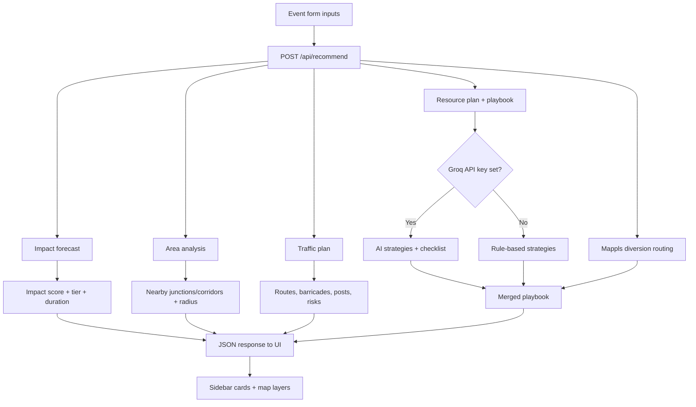

# Plan an Event — Complete Guide

GridSense’s **Plan an Event** feature (`/plan`) helps Bengaluru Traffic Police plan ahead for a planned or unplanned traffic event. You describe the event, and the system returns:

1. A **traffic impact forecast** (how bad, how long, how wide)
2. An **operational playbook** (strategies, manpower, barricades, diversion advice, checklist)
3. A **traffic management plan** (ingress/egress routes, barricades, deployment posts on the map)
4. An **interactive map** showing routes, control points, and the affected area

This document explains every input, every output, and how the pieces fit together.

---

## Table of contents

1. [How to use the page](#how-to-use-the-page)
2. [End-to-end flow](#end-to-end-flow)
3. [All inputs (form fields)](#all-inputs-form-fields)
4. [Impact forecast outputs](#impact-forecast-outputs)
5. [Traffic impact outputs](#traffic-impact-outputs)
6. [Operational playbook outputs](#operational-playbook-outputs)
7. [Traffic plan outputs (routes & map)](#traffic-plan-outputs-routes--map)
8. [Map legend & layers](#map-legend--layers)
9. [Event phases](#event-phases)
10. [Glossary](#glossary)
11. [AI vs rule-based generation](#ai-vs-rule-based-generation)
12. [API reference](#api-reference)
13. [Built-in sample scenarios](#built-in-sample-scenarios)

---

## How to use the page

The page is split into two panels:

| Panel | Purpose |
|-------|---------|
| **Left sidebar** | Event form + all result cards (forecast, strategies, advisory, resources, checklist) |
| **Right map** | Venue focus circle, diversion routes, traffic routes, barricades, deployment posts |

**Typical workflow:**

1. Pick a **quick scenario preset** (e.g. “Cricket match · Chinnaswamy”) or fill the form manually.
2. **Click the small map** in the form to place the venue pin (latitude/longitude).
3. Select **road segments to close** if the event blocks traffic.
4. Click **“Forecast & build playbook”** (or wait — the page auto-runs once on load).
5. Review the **impact score**, **recommended strategy**, **traffic impact**, and **map overlays**.
6. Use the **map legend** to filter by event phase or show contingency routes.
7. Click different **diversion route options** to highlight alternates on the map.

---

## End-to-end flow

When you submit the form, the browser calls `POST /api/recommend` with your inputs. The server runs several engines in parallel:



**Data sources behind the engines:**

| Engine | Primary data |
|--------|----------------|
| Impact forecast | 8,173 ASTraM historical events, trained duration lookup table, corridor/cause priors |
| Area analysis | Historical events + hotspot grid near your venue pin |
| Traffic plan | Synthetic Bengaluru road graph (CBD / Chinnaswamy area), trip demand model, A* pathfinding |
| Playbook strategies | Rule catalog + optional Groq LLM (grounded on forecast stats) |
| Diversion routing | MapmyIndia (Mappls) Directions API when available; mock geometry fallback |

---

## All inputs (form fields)

Every field in the form maps to `EventPlannerInput` and is sent to `/api/recommend`.

### Quick scenario presets

Pre-filled examples you can load with one click:

| Preset | What it models |
|--------|----------------|
| Cricket match · Chinnaswamy | Large sports event, road closure, peak hour, weekend |
| Metro construction · ORR | Planned construction closure on ORR |
| Heavy-vehicle breakdown · Hosur Rd | Unplanned truck breakdown at Silk Board |
| Waterlogging · Mysore Rd | Rain/waterlogging incident |

### Event identity

| Field | Type | Meaning |
|-------|------|---------|
| **Event name** | Text | Label for the plan (e.g. “Chinnaswamy Day Match”). Shown on the map focus pin. |
| **Event type** | Dropdown | Category that shapes crowd/traffic behaviour. Options: public gathering, sports match, concert/festival, political rally, religious procession, marathon/road race, VIP movement, construction/road closure. Affects trip demand (how many vehicles per person, walk share). |

### Location

| Field | Type | Meaning |
|-------|------|---------|
| **Venue location (map pin)** | `lat`, `lon` | **Required for traffic routes on the map.** Click the small Leaflet map in the form to set coordinates. The traffic engine snaps this to the nearest node on the road graph. Without a pin, you still get a forecast and playbook, but no `traffic_plan`. |
| **Corridor** | Dropdown | Named arterial from ASTraM data (e.g. “CBD 2”, “Hosur Road”, “ORR East 1”). Used for **location sensitivity** in the impact score and historical context. Not the same as an access corridor in the traffic plan (see Glossary). |
| **Zone** | Dropdown | Police zone (e.g. “Central Zone 2”). Context for the playbook; options loaded from `/api/aggregates`. |
| **Junction (optional)** | Text | Main intersection you care about (e.g. “Silk Board”, “Chinnaswamy”). Used in playbook actions like “Prioritize control around {junction}”. |
| **Affected junctions** | Slider 1–6 | **Count** of intersections expected to be impacted (not names). More junctions → more officers and barricades in the resource plan. |

### Scale & timing

| Field | Type | Meaning |
|-------|------|---------|
| **Expected attendance** | Band dropdown | Crowd size band: `<500`, `500–2000`, `2000–10000`, `10000–50000`, `>50000`. Sets a default headcount and the **affected radius** around the venue (350 m – 1500 m). Drives trip demand (vehicles arriving/leaving). |
| **Start hour** | 0–23 | When the event starts (24h clock). Used in trip demand curves. |
| **End hour** | 0–23 | When the event ends. |
| **Entry / exit gates** | 1–10 | Number of venue gates. Influences how arrival/departure flow is split. |
| **Hour** | Slider 0–23 | Hour of day for the **impact model** (when congestion is worst). Separate from start/end hour. |
| **Day** | Mon–Sun | Day of week. Weekend sets `is_weekend` automatically. |

### Event context (ASTraM-style)

| Field | Type | Meaning |
|-------|------|---------|
| **Cause** | Dropdown | ASTraM event cause: public event, construction, accident, water logging, vehicle breakdown, etc. Strongly affects predicted **clearance duration** and equipment list. |
| **Vehicle type** | Dropdown | Dominant vehicle involved (private car, truck, BMTC bus, etc.). Affects diversion routing (e.g. heavy-vehicle-safe route). |
| **Priority** | High / Low | High priority adds to the timing factor in the impact score. |
| **Road segments to close** | Multi-select buttons | Which road names are closed for the event. Toggles `requires_road_closure` on. Matched to edges on the road graph for routing around closures. |

### Boolean toggles

| Toggle | Meaning | Effect |
|--------|---------|--------|
| **Parking required** | Venue has dedicated parking | Context for planning; large events with parking spread arrivals. |
| **Public transport involved** | Metro/bus expected | Increases walk + transit share in trip demand; lowers private vehicle trips. |
| **Heavy vehicle restriction** | Trucks/buses restricted near venue | Prefer heavy-vehicle diversion routes. |
| **Road closure** | Through-traffic blocked | Major driver: forces diversion strategy, raises impact score closure factor, increases barricades. Auto-set when you pick closed road segments. |
| **Peak hour** | Event overlaps Bengaluru peak windows | Raises impact score timing factor; increases manpower by ~30%. |
| **Planned** | Known in advance | Enables advance public advisory strategy; sets diversion lead time. |
| **Weekend** | Saturday or Sunday | Context for playbook selection. |

---

## Impact forecast outputs

Shown in the **Impact forecast** card (gauge + factor bars).

| Output | Meaning |
|--------|---------|
| **Impact score** (0–100) | Overall congestion severity. Weighted sum of five factors (see below). Higher = worse. |
| **Tier** | Bucket: `Low` (<30), `Moderate` (30–49), `High` (50–69), `Severe` (≥70). Drives manpower defaults. |
| **Expected clearance** | Predicted time until traffic returns to normal (minutes). From ML duration lookup trained on ASTraM. |
| **Affected radius** | Approximate circle around the venue (metres). Formula: `250 + 4 × impact_score`. Shown as the coloured ring on the map. |

### Impact score factors (“Why this score”)

| Factor | Weight | What it measures |
|--------|--------|------------------|
| **Duration** | 34% | How long clearance is expected to take (vs 12-hour saturation cap). |
| **Closure** | 22% | 1 if road closure required, else 0. |
| **Cause** | 16% | Historical severity of this cause (water logging and construction score higher than breakdowns). |
| **Location** | 16% | How sensitive this **corridor** is based on past event density. |
| **Timing** | 12% | Peak hour (+ high priority boost). |

Each bar shows that factor’s **contribution** to the total score (factor × weight × 100).

---

## Traffic impact outputs

Shown in the **Traffic impact** card (only when venue `lat`/`lon` are set).

| Output | Meaning |
|--------|---------|
| **Peak arrival** (vph) | Peak vehicles per hour arriving at the venue during the pre-event window. |
| **Peak departure** (vph) | Peak vehicles per hour leaving during dispersal. Usually higher than arrival (everyone leaves at once). |
| **Vehicle trips** | Total car/taxi trips estimated from attendance ÷ occupancy (varies by event type). Walkers excluded. |
| **Dispersal p90** (min) | 90th percentile time to clear the crowd from roads after the event ends (simulation). |
| **Baseline delay** (min) | Extra travel time vs free-flow during the event. |
| **Load factor** (%) | How saturated the road network is (departure peak vs reference capacity). |
| **Critical edges** | Road segments where assigned flow exceeds capacity. Shows name, utilization %, and flow (vph). These appear as **red lines** on the map. |

**Behind the scenes:** `buildTripDemand()` converts attendance → arrival/departure curves. `buildTrafficPlan()` routes vehicles on the road graph and runs dispersal scenarios (nominal, one primary closed, rain slowdown).

---

## Operational playbook outputs

### Recommended strategy

The top strategy card shows the **best-fit management approach** and **why** it was chosen (bullet points from AI or rules).

**Available strategy types:**

| Strategy | When it’s used |
|----------|----------------|
| **Full Diversion** | Road closure — all through-traffic must use alternates |
| **Partial Flow Management** | One lane still passable; taper and meter flow |
| **Peak-Hour Restriction** | Long planned work; shift to off-peak |
| **Rapid Clearance** | Breakdown/obstruction — clear and reopen fast |
| **Heavy-Vehicle Diversion** | Truck blocking; cars can still pass |
| **Public Advisory First** | Planned event — reduce demand before it builds |
| **Junction Protection** | Prevent spillback/gridlock at upstream intersections |

Each strategy includes: expected congestion reduction, resource/barricade demand, communication need, complexity, reasoning, and concrete actions.

### Operational playbook list

All candidate strategies with badges. Click to compare; the recommended one is highlighted.

### Operational advisory

| Field | Meaning |
|-------|---------|
| **Control style** | e.g. “Full closure”, “Dynamic”, “Lane taper” |
| **Impacted corridor** | Main road affected (from traffic plan access corridors or playbook) |
| **Candidate alternates** | Named inbound/diversion route IDs from the traffic engine |
| **Control points** | Junctions/corridors where officers should be posted |
| **Public note** | Suggested message for public communication |
| **Diversion route options** | Up to 3 Mappls-computed alternates: primary, secondary arterial, heavy-vehicle safe. Each has distance (km), extra travel time (min), and geometry drawn on the map. |
| **Routing source** | `MapmyIndia` if live API worked, else `mock` |
| **Copy advisory** | Button to copy all advisory text to clipboard |

### Resource plan

| Field | Meaning |
|-------|---------|
| **Officers range** | Estimated constables needed (e.g. “14–20”) |
| **Barricades range** | Estimated barricade units |
| **Shifts** | 1 or 2 (2 if event duration > 4 hours) |
| **Head constables / constables / wardens** | Role breakdown |
| **Special units** | Equipment by cause (cones, pumps, recovery crane, etc.) |
| **Narrative** | Plain-language deployment summary |

**Formula drivers:** impact tier, number of affected junctions, road closure, peak hour, sensitive corridor.

### Field checklist

Three lists of tasks:

- **Before** — deploy, barricade, publish advisory
- **During** — monitor flow, adjust diversion, update public
- **After** — remove barricades, evaluate effectiveness

### Access corridors (sidebar list)

Road approaches discovered from the venue pin on the road graph:

| Part | Meaning |
|------|---------|
| **Name** | e.g. “MG Road”, “Cubbon Road”, “Queens Road” |
| **Direction** | `inbound`, `outbound`, or `bidirectional` |
| **Capacity (vph)** | Base vehicles-per-hour capacity of that approach |

---

## Traffic plan outputs (routes & map)

Returned as `traffic_plan` when `lat` and `lon` are provided. Powers most map overlays.

### Route bundles

Routes are grouped by purpose and phase:

| Route type | Colour on map | Meaning |
|------------|---------------|---------|
| **Primary inbound** | Solid blue | Main route for vehicles **entering** the venue |
| **Secondary inbound** | Dashed light blue | Backup ingress if primary is full |
| **Primary outbound** | Solid orange | Main route for vehicles **leaving** after the event |
| **Secondary outbound** | Dashed light orange | Backup egress / staggered exit waves |
| **Through diversion** | Green | Path for **through-traffic** that cannot use closed roads |
| **Emergency access** | Purple dashed | Ambulance/fire route — must stay open |
| **Contingency** | Grey dashed | Pre-ranked backup paths if a primary route fails |
| **Bottleneck edge** | Red thick line | Road segment over capacity (critical edge) |

Each route also carries (in API JSON):

| Property | Meaning |
|----------|---------|
| `phase` | When this route is active (arrival, during, dispersal, etc.) |
| `distance_km` | Route length |
| `expected_travel_min` | Travel time under load |
| `assigned_flow_vph` | Vehicles assigned to this route |
| `utilization` | Flow ÷ capacity ( >1 = overloaded ) |
| `bottleneck_edges` | Which graph edges are saturated on this route |

### Barricade points

| Property | Meaning |
|----------|---------|
| **Location** (`lat`, `lon`) | Orange circle on map — where to place barricades |
| **Label** | e.g. “Soft taper — MG Road” |
| **Type** | `hard`, `soft`, or `coning` |
| **Officers required** | Staff at this barricade |
| **phase_active** | Which event phases this barricade is used |

Barricades are **snapped to road graph edges** near closure points, not random offsets.

### Deployment posts

| Property | Meaning |
|----------|---------|
| **Location** (`lat`, `lon`) | Blue circle on map — where officers stand |
| **Role** | `traffic_point`, `crowd_control`, `diversion_guide`, `vip_escort`, `quick_response` |
| **Officers** | Headcount at this post |
| **Shift** | `pre_event`, `during`, `post_event`, or `all` |
| **Label** | e.g. “Venue gate crowd control”, “outbound control — Stadium Approach” |

### Risks (API only, not yet a dedicated UI card)

Each risk has: description, likelihood, impact, trigger condition, contingency action, and which routes to activate.

### Signage (API only)

Recommended sign messages by phase and location (e.g. “Follow MG Road to venue parking” at arrival).

### Area analysis (`area` in API)

| Field | Meaning |
|-------|---------|
| `estimated_radius_m` | Planning radius from attendance band |
| `nearby_junctions` | Junction names from historical ASTraM events near the pin |
| `nearby_corridors` | Corridors with past incidents near the pin |
| `peak_conflict_windows` | Typical busy time windows in Bengaluru |

---

## Map legend & layers

The map (right panel) uses **MapmyIndia (Mappls)** when a token is available, else **Leaflet + Carto dark tiles**.

| Layer | Visual | Source |
|-------|--------|--------|
| **Focus circle** | Coloured ring around venue | Impact tier colour; radius from area analysis or forecast |
| **Venue pin** | Marker at `lat`/`lon` | Event name + attendance + active phase |
| **Diversion options** | Green / amber / red polylines | Mappls Directions (or mock) — click routes in advisory card |
| **Traffic routes** | Coloured lines per table above | `traffic_plan.routes` |
| **Barricades** | Orange circles | `traffic_plan.barricade_points` |
| **Deployment posts** | Blue circles | `traffic_plan.deployment_posts` |
| **Bottlenecks** | Red lines | `traffic_plan.bottleneck_edges` |

**Phase filter** (legend buttons): labels the focus pin with the selected phase (`pre_event`, `arrival`, `during`, `dispersal`, `post_event`). Routes are currently shown for **all phases** on the map; contingency routes toggle separately.

**Show contingency routes:** Adds grey backup paths to the map.

---

## Event phases

Phases model the **timeline of a planned event**:

| Phase | Real-world meaning |
|-------|-------------------|
| **pre_event** | Setup, early arrivals, soft closures |
| **arrival** | Main ingress peak (fans arriving) |
| **during** | Event in progress; through-traffic diverted |
| **dispersal** | Exit peak (everyone leaving) |
| **post_event** | Cleanup, late departures |
| **contingency** | Backup plans if something fails |

Routes, barricades, and posts can be tagged with which phases they apply to.

---

## Glossary

| Term | Simple explanation |
|------|-------------------|
| **Corridor** | A named major road in ASTraM police data (e.g. “Hosur Road”, “CBD 2”). Used for historical scoring — **not** the same as a computed route. |
| **Access corridor** | A road **approach** to the venue discovered on the road graph (e.g. “MG Road inbound”). Has direction and capacity. |
| **Junction** | A road **intersection** where traffic merges or is controlled. “Affected junctions” is a count; “Junction (optional)” is a name. |
| **Edge** | One directed road segment in the graph (e.g. “Stadium Approach”). Routes are chains of edges. |
| **vph** | Vehicles per hour — standard traffic flow unit. |
| **Utilization** | Flow ÷ capacity. 100% = at limit; >100% = queue/spillback risk. |
| **Spillback** | When queues at one junction block upstream roads (gridlock). |
| **Dispersal** | How long it takes everyone to leave by road after the event. |
| **Playbook** | Full operational package: strategies, resources, advisory, checklist, map pins. |

---

## AI vs rule-based generation

| Component | How it’s produced |
|-----------|-------------------|
| Impact score, tier, duration, radius | **Deterministic** — trained model + ASTraM priors |
| Manpower / barricade numbers | **Rule formulas** — always reproducible |
| Traffic plan (routes, barricades, posts) | **Deterministic** — road graph + pathfinding |
| Diversion geometry | **Mappls API** or mock fallback |
| Strategies, why bullets, checklist prose | **Groq LLM** if `GROQ_API_KEY` is set; else **rule engine** |

The UI shows **AI-generated** or **rule-based** on the playbook card (`source: "ai" | "rules"`).

Even with AI, resource numbers and traffic geometry come from the rule/traffic engines so they stay consistent.

---

## API reference

### `POST /api/recommend`

**Request body:** `EventPlannerInput` (all form fields as JSON)

**Response:** `RecommendResponse`

```json
{
  "forecast": { "impact_score", "tier", "expected_duration_min", "affected_radius_m", "factors", "weights", "contributions" },
  "plan": { "manpower", "barricading", "diversion", "confidence", "narrative", "deployment_posts" },
  "playbook": { "recommended_strategy_id", "why", "strategies", "resource_plan", "advisory", "barricade_points", "deployment_posts", "checklist" },
  "area": { "estimated_radius_m", "nearby_junctions", "nearby_corridors", "peak_conflict_windows" },
  "traffic_plan": { "venue_node_id", "access_corridors", "traffic_impact", "routes", "barricade_points", "deployment_posts", "risks", "signage", "bottleneck_edges" },
  "source": "ai" | "rules"
}
```

`traffic_plan` is `null` if no venue coordinates are provided.

### Supporting endpoints

| Endpoint | Purpose |
|----------|---------|
| `GET /api/aggregates` | Cause, corridor, zone, vehicle type dropdown options |
| `GET /api/maptoken` | Short-lived Mappls token for the basemap |

---

## Built-in sample scenarios

### Cricket match · Chinnaswamy

- 28,000 attendance, sports match, CBD 2 corridor  
- Road closures on main approaches, peak hour weekend  
- Venue: M. Chinnaswamy Stadium (`12.9788, 77.5996`)  
- Typical output: Moderate–High impact, full diversion, multi-route traffic plan around MG Road / Cubbon Road  

### Metro construction · ORR

- 1,100 attendance, construction closure on ORR East  
- Planned, 2 affected junctions  

### Heavy-vehicle breakdown · Hosur Rd

- Unplanned truck breakdown at Silk Board  
- No road closure; rapid clearance strategy  

### Waterlogging · Mysore Rd

- Rain impact at Nayandahalli  
- Public transport involved  

---

## Key files in the codebase

| File | Role |
|------|------|
| `web/src/app/plan/page.tsx` | Plan page UI |
| `web/src/components/playbook/EventPlannerForm.tsx` | Form + sample scenarios |
| `web/src/app/api/recommend/route.ts` | API orchestrator |
| `web/src/lib/gridsense.ts` | Impact forecast + resource formulas |
| `web/src/lib/playbook.ts` | Strategy rule engine |
| `web/src/lib/trafficPlanner.ts` | Traffic plan orchestrator |
| `web/src/lib/tripDemand.ts` | Crowd → vehicle trip model |
| `web/src/lib/roadGraph.ts` | Road network + corridor discovery |
| `web/src/lib/eventAnalysis.ts` | Nearby junctions/corridors |
| `web/src/lib/trafficMapLayers.ts` | Map route colours + phase filter |
| `web/src/components/MapplsMap.tsx` | Mappls map overlays |
| `web/src/components/BengaluruMap.tsx` | Leaflet fallback map |
| `web/src/data/road_graph.json` | CBD synthetic road network |

---

## Tips for accurate plans

1. **Always set the venue pin** — without it you get forecast + playbook but no traffic routes on the map.  
2. **Match corridor to real location** — improves impact score location factor.  
3. **Select actual closed road segments** — closures are matched to graph edges for realistic diversions.  
4. **Use affected junctions honestly** — directly scales officer and barricade counts.  
5. **Wait for “Building playbook…” to finish** — map layers populate after the API returns (a few seconds).  
6. **Hard-refresh** after deployments if map overlays look missing (browser cache).

---

*GridSense · ASTraM · MapmyIndia · Flipkart Gridlock 2.0*
